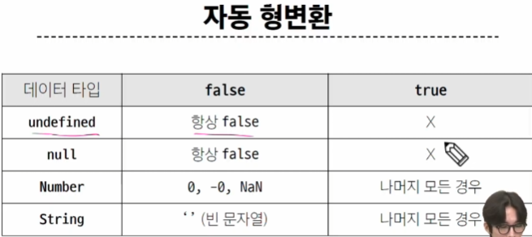
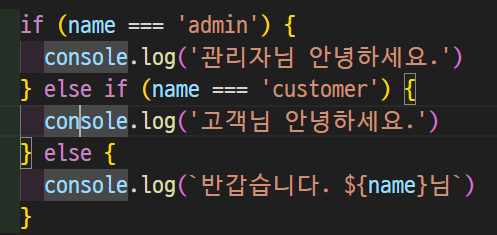

# 변수
## 개요
### JavaScript 문법 학습
* ECMAScript 2015 (ES6) 이후의 명제를 따름
* 권장 스타일 가이드: https://standardjs.com/rules-kokr.html
## 변수 선언 키워드
### 식별자(변수명) 작성 규칭
* 반드시 문자, 달러('$') , 밑줄('_')fh tlwkr
* 대소문자 구분
* 예약어 사용 불가 (ex) for, if, function 등

### 식별자(변수명) Naming case
* 카멜 케이스(camelCase): 변수, 객체, 함수에 사용
    * 카멜 케이스: 단어 연결 시 첫글자는 소문자로 하지만 남은 단어의 첫글자는 대문자로 표기하는 규칙
* 파스칼 케이스(PascalCase): 클래스, 생성자에 사용
    * 파스칼 케이스: 첫 단어의 첫 글자도 대문자로 표기하는 명명 규칙 (ex) MyClass, CalculateDiscountAmount
* 대문자 스네이크 케이스(SNAKE_CASE): 상수(constants)에 사용 

### 변수 선언 키워드 3가지
1. let
* 블록 스코프(block scope)를 갖는 지역 변수를 선언
* 재할당 가능
* 재선언 불가능
* ES6에서 추가
```js
let number = 10 // 1. 선언 및 초기값 할당
number = 20 // 2. 재할당
```
```js
let number = 10 // 1. 선언 및 초기값 할당
let number = 20 // 2. 재선언 불가능
```

2. const
* 블록 스코프를 갖는 지역 변수를 선언
3. var
# 데이터 타입
## 원시 자료형

데이터 타입의 이름이 객체
object인데 다름
ㅋ...
Number 정수 실수형 숫자 
Infinity 라는 키워드가 존재해서 무한대가 값을 설정 가능
NaN  숫자 데이터 타입중 한개인데 숫자로 계산할 수 없을때의 반환값으로 나옴
ex 문자열 'ab'/3 같은 것
파이썬에서는 문자열 * 숫자가 가능하지만 여기는 불가능 +만 가능
두번째언어
기존에 아는 언어랑 차이가 무엇인가
| ${expression}

파이썬 f-string 이랑 비슷비슷~
근데 ",'가 아니라 ``이걸로 감쌈
boolean에서 트루 폴스에서 t,f가 소문자임



===가 있음 암묵적 형변환 하지 않음

# 연산자
동등연산자를 써라 이게 아니면 무조건 ===일치연산자를 쓰셈
논리연산자
&&
and
||
or
!
not
단축평가 지원

약간 옹졸함

여기 보면 뭔가 엔터 쳐도 될것같지만 그렇게 쓰지않음

py 딕트 키 밸류의 키가 여기서는 프로퍼티임
접근은 object[property] 오브젝트는 딕트임

for에서 in과 of 나눠진 이유는??
뭔차이인지 죽어도 모르겠음
in은 열거가능한 속성을 출력
이배열의 인덱스가 속성이라는 의미

# 조건문
* if: 조건 표현식의 결과값을 boolean 타입으로 변환 후 참/거짓을 판단

### 삼항 연산자
```js
condition ? expression1 : expression2
```
* condition: 평가할 조건 (true 또는 false로 평가)
* expression1: 조건이 true일 경우 반환할 값 또는 표현식
* expression2: 조건이 false일 경우 반환할 값 또는 표현식
# 반복문
