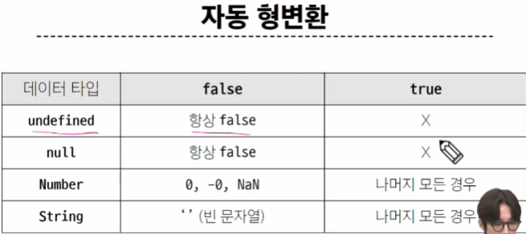
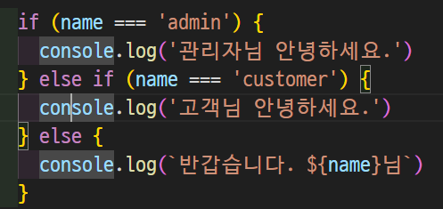

# 변수
## 변수 선언 키워드
* 식별자(변수명) 작성 규칭
    * 반드시 문자, 달러('$') , 밑줄('_')fh tlwkr
    * 대소문자 구분
    * 예약어 사용 불가 (ex) for, if, function 등

* 식별자(변수명) Naming case
    * 카멜 케이스(camelCase): 변수, 객ㅊ, 함수에 사용
        * 카멜 케이스: 단어 연결 시 첫글자는 소문자로 하지만 남은 단어의 첫글자는 대문자로 표기하는 규칙
    * 파스칼 케이스(PascalCase): 클래스, 생성자에 사용
        * 파스칼 케이스: 
    * 
데이터 타입의 이름이 객체
object인데 다름
ㅋ...
Number 정수 실수형 숫자 
Infinity 라는 키워드가 존재해서 무한대가 값을 설정 가능
NaN  숫자 데이터 타입중 한개인데 숫자로 계산할 수 없을때의 반환값으로 나옴
ex 문자열 'ab'/3 같은 것
파이썬에서는 문자열 * 숫자가 가능하지만 여기는 불가능 +만 가능
두번째언어
기존에 아는 언어랑 차이가 무엇인가
${expression}
파이썬 f-string 이랑 비슷비슷~
근데 ",'가 아니라 ``이걸로 감쌈
boolean에서 트루 폴스에서 t,f가 소문자임

===가 있음 암묵적 형변환 하지 않음

동등연산자를 써라 이게 아니면 무조건 ===일치연산자를 쓰셈
논리연산자
&&
and
||
or
!
not
단축평가 지원

약간 옹졸함

여기 보면 뭔가 엔터 쳐도 될것같지만 그렇게 쓰지않음

py 딕트 키 밸류의 키가 여기서는 프로퍼티임
접근은 object[property] 오브젝트는 딕트임

for에서 in과 of 나눠진 이유는??
뭔차이인지 죽어도 모르겠음
in은 열거가능한 속성을 출력
이배열의 인덱스가 속성이라는 의미
