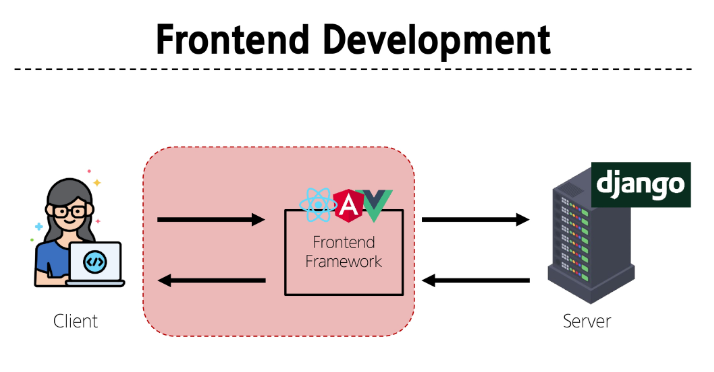

# Frontend Development
웹사이트와 웹 애플리케이션의 사용자 인터페이스(UI)와 사용자 경험(UX)을 만들고 디자인하는 것
-> HTML, CSS, JavaScript 등을 활용하여 사용자가 직접 상호작용하는 부분을 개발

## Client-side frameworks
클라이언트 측에서 UI와 상호작용을 개발하기 위해 사용되는 JavaScript 기반 프레임워크
* 필요한 이유
    * "웹에서 하는 일이 많아졌다."
        1. 단순히 무언가를 읽는 곳 -> 무언가를 하는 곳 
            (ex) 웹에서 문서만을 읽는 게 아닌 음악을 스트리밍하고, 영화를 보고, 지구 반대편 사람들과 텍스트 및 영상 채팅을 통해 즉시 통신하고 있음
            * 현대적이고 복잡한 대화형 웹 사이트를 "웹 애플리케이션(web applications)"이라 부름
            * JavaScript 기반의 Clien-side frameworks가 등장하면서 매우 동적인 대화형 애플리케이션을 훨씬 더 쉽게 구축할 수 있게 됨
        2. "다루는 데이터가 많아졌다."
            (ex) 친구가 이름을 변경한다면 친구목록, 타임라인, 스토리 등 친구 이름이 출력되는 모든 곳이 함께 변경되어야 함
            * 애플리케이션의 기본 데이터를 안정적으로 추적하고 업데이트(렌더링, 추가, 삭제 등)하는 도구가 필요
            -> 애플리케이션의 상태를 변경할 때마다 일치하도록 UI를 업데이트해야 함

하지만 Vanilla JS 만으로는 쉽지 않음
* 불필요한 코드의 반복
## SPA(Single Page Application)
단일 페이지로 구성된 애플리케이션
* 하나의 HTML 파일로 시작하여, 사용자가 상호작용할 때마다 페이지 전체를 새로 로드하지 않고 화면의 필요한 부분만 동적으로 갱신
* 대부분 JavaScript 프레임워크를 사용하여 클라이언트 측에서 UI와 렌더링을 관리
-> CSR방식 사용

### Client-side Rendering(SCR)
클라이언트에서 화면을 렌더링 하는 방식
* 동작 과정
    1. 브라우저는 서버로부터 최소한의 HTML 페이지와 해당 페이지에 필요한 JavaScript 응답 받음
    2. 그런 다음 클라이언트 측에서 JavaScript를 사용하여 DOM을 업데이트하고 페이지를 렌더링
    3. 이후 서버는 더 이상 HTML을 제공하지 않고 요청에 필요한 데이터만 응답
    -> Google Maps, Facebook, Instagram 등의 서비스에서 페이지 갱신 시 새로고침이 없는 이유

#### CSR 장점
1. 빠른 페이지 전환
    * 페이지가 처음 로드된 후에는 필요한 데이터만 가져오면 되고 JavaScript는 전체 페이지를 새로 고칠 필요 없이 페이지의 일부를 다시 렌더링할 수 있기 때문
    * 서버로 전송되는 데이터의 양을 최소화 (서버 부하 방지)

2. 사용자 경험
    * 새로고침이 발생하지 않아 네이티브 앱과 유사한 사용자 경험을 제공
3. Frontend와 Backend의 명확한 분리
    * Frontend는 UI 렌더링 및 사용자 상호 작용 처리를 담당 & Backend는 데이터 및 API 제공을 담당
    * 대규모 애플리케이션을 더 쉽게 개발하고 유지 관리 가능

#### CSR 단점
1. 느린 초기 로드 속도
    * 전체 페이지를 보기 전에 약간의 지연을 느낄 수 있음
    * JavaScript가 다운로드, 구문 분석 및 실행될 때까지 페이지가 완전히 렌더링 되지 않기 때문
2. SEO(검색 엔진 최적화) 문제
    * 페이지를 나중에 그려 나가는 것이기 때문에 검색에 잘 노출되지 않을 수 있음
    * 검색엔진 입장에서 HTML을 읽어서 분석해야 하는데 아직 콘텐츠가 모두 존재하지 않기 때문

#### SPA vs. MPA / CSR vs. SSR
* Multi Page Application (MPA)
    * 여러 개의 HTML 파일이 서버로부터 각각 로드
    * 사용자가 다른 페이지로 이동할 때마다 새로운 HTML 파일이 로드됨
* Server-side Rendering(SSR)
    * 서버에서 화면을 렌더링 하는 방식
    * 모든 데이터가 담긴 HTML을 서버에서 완성 후 클라이언트에게 전달

# Vue
Vue.js : 사용자 인터페이스를 구축하기 위한 JavaScript 프레임워크
