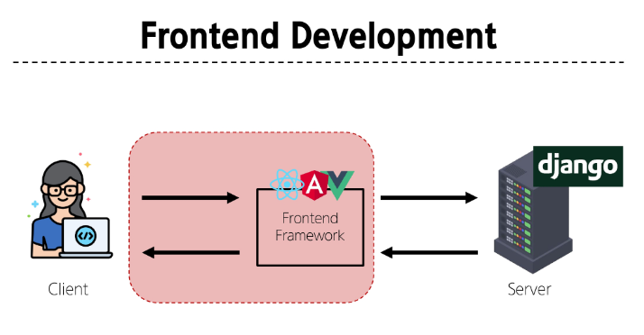
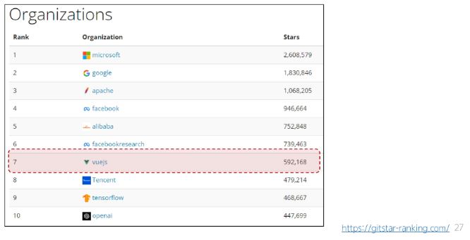
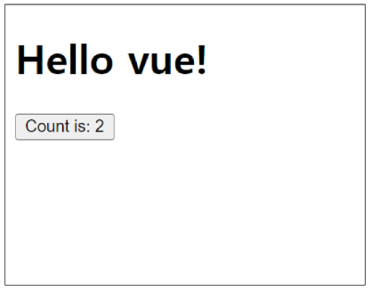
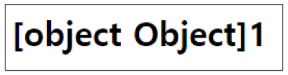
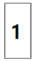
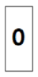

# Frontend Development
웹사이트와 웹 애플리케이션의 사용자 인터페이스(UI)와 사용자 경험(UX)을 만들고 디자인하는 것
-> HTML, CSS, JavaScript 등을 활용하여 사용자가 직접 상호작용하는 부분을 개발

## Client-side frameworks
클라이언트 측에서 UI와 상호작용을 개발하기 위해 사용되는 JavaScript 기반 프레임워크
* 필요한 이유
    * "웹에서 하는 일이 많아졌다."
        1. 단순히 무언가를 읽는 곳 -> 무언가를 하는 곳 
            (ex) 웹에서 문서만을 읽는 게 아닌 음악을 스트리밍하고, 영화를 보고, 지구 반대편 사람들과 텍스트 및 영상 채팅을 통해 즉시 통신하고 있음
            * 현대적이고 복잡한 대화형 웹 사이트를 "웹 애플리케이션(web applications)"이라 부름
            * JavaScript 기반의 Clien-side frameworks가 등장하면서 매우 동적인 대화형 애플리케이션을 훨씬 더 쉽게 구축할 수 있게 됨
        2. "다루는 데이터가 많아졌다."
            (ex) 친구가 이름을 변경한다면 친구목록, 타임라인, 스토리 등 친구 이름이 출력되는 모든 곳이 함께 변경되어야 함
            * 애플리케이션의 기본 데이터를 안정적으로 추적하고 업데이트(렌더링, 추가, 삭제 등)하는 도구가 필요
            -> 애플리케이션의 상태를 변경할 때마다 일치하도록 UI를 업데이트해야 함

하지만 Vanilla JS 만으로는 쉽지 않음
* 불필요한 코드의 반복
## SPA(Single Page Application)
단일 페이지로 구성된 애플리케이션
* 하나의 HTML 파일로 시작하여, 사용자가 상호작용할 때마다 페이지 전체를 새로 로드하지 않고 화면의 필요한 부분만 동적으로 갱신
* 대부분 JavaScript 프레임워크를 사용하여 클라이언트 측에서 UI와 렌더링을 관리
-> CSR방식 사용

### Client-side Rendering(SCR)
클라이언트에서 화면을 렌더링 하는 방식
* 동작 과정
    1. 브라우저는 서버로부터 최소한의 HTML 페이지와 해당 페이지에 필요한 JavaScript 응답 받음
    2. 그런 다음 클라이언트 측에서 JavaScript를 사용하여 DOM을 업데이트하고 페이지를 렌더링
    3. 이후 서버는 더 이상 HTML을 제공하지 않고 요청에 필요한 데이터만 응답
    -> Google Maps, Facebook, Instagram 등의 서비스에서 페이지 갱신 시 새로고침이 없는 이유

#### CSR 장점
1. 빠른 페이지 전환
    * 페이지가 처음 로드된 후에는 필요한 데이터만 가져오면 되고 JavaScript는 전체 페이지를 새로 고칠 필요 없이 페이지의 일부를 다시 렌더링할 수 있기 때문
    * 서버로 전송되는 데이터의 양을 최소화 (서버 부하 방지)

2. 사용자 경험
    * 새로고침이 발생하지 않아 네이티브 앱과 유사한 사용자 경험을 제공
3. Frontend와 Backend의 명확한 분리
    * Frontend는 UI 렌더링 및 사용자 상호 작용 처리를 담당 & Backend는 데이터 및 API 제공을 담당
    * 대규모 애플리케이션을 더 쉽게 개발하고 유지 관리 가능

#### CSR 단점
1. 느린 초기 로드 속도
    * 전체 페이지를 보기 전에 약간의 지연을 느낄 수 있음
    * JavaScript가 다운로드, 구문 분석 및 실행될 때까지 페이지가 완전히 렌더링 되지 않기 때문
2. SEO(검색 엔진 최적화) 문제
    * 페이지를 나중에 그려 나가는 것이기 때문에 검색에 잘 노출되지 않을 수 있음
    * 검색엔진 입장에서 HTML을 읽어서 분석해야 하는데 아직 콘텐츠가 모두 존재하지 않기 때문

#### SPA vs. MPA / CSR vs. SSR
* Multi Page Application (MPA)
    * 여러 개의 HTML 파일이 서버로부터 각각 로드
    * 사용자가 다른 페이지로 이동할 때마다 새로운 HTML 파일이 로드됨
* Server-side Rendering(SSR)
    * 서버에서 화면을 렌더링 하는 방식
    * 모든 데이터가 담긴 HTML을 서버에서 완성 후 클라이언트에게 전달

# Vue
Vue.js : 사용자 인터페이스를 구축하기 위한 JavaScript 프레임워크
## What is Vue
* Evan You에 의해 발표(2014)
    - 학사 - 미술, 미술사/석사-디자인&테크놀로지 전공
    - Angular 개발팀 출신\
* 최신 버전은 "Vue 3" (2024)
    - https://vuejs.org/

==> Vue2 문서에 접속하지 않도록 주의!

### Vue를 학습하는 이유
1. 쉬운 학습 곡선
    - 간결하고 직관적인 문법을 가지고 있어 빠르게 익힐 수 있음
    - 잘 정리된 문서를 기반으로 어렵지 않게 학습 할 수 있음
2. 확장성과 생태계
    - 다양한 플러그인과 라이브러리를 제공하는 높은 확장성
    - 전세계적으로 활성화된 커뮤니티를 기반으로 많은 개발자들이 새로운 기능을 개발하고 공유하고 있음
3. 유연성 및 성능
    - 작은 규모의 프로젝트부터 대규모의 애플리케이션까지 다양한 프로젝트에 적합
4. 가장 주목받는 Client-side framework


### SSAFY에서의 Vue
* Vue는 React나 Angular 대비 간결하고 직관적인 문법을 가지고 있어 학습이 상대적으로 원활
    - 짧은 시간내에 효율적으로 결과물을 만들어 낼 수 있음

* 거대하고 활발한 커뮤니티를 가지고 있어 풍부한 문서, 튜토리얼, 예제 및 다양한 리소스를 공유 받을 수 있음
    - 최신 업데이트 및 트렌드를 공유함으로써 지속적인 학습을 촉진

### Vue 체험하기
```html:first-vue.html
<div id="app">
    <h1>{{ message }}</h1>
    <button @click="count++">
        Count is: {{count}}
    </button>
</div>
```
```html
<script src="https://unpkg.com/vue@3/dist/vue.global.js"></script>

<script>
    const {createApp, ref} = Vue
    
    const app = createApp({
        setup() {
            const message = ref('Hello vue!')
            const count = ref(0)

            return {
                message,
                count
            }
        }
    })

    app.mount('#app')
</script>
```
결과


### Vue의 2가지 핵심 기능
1. 선언적 렌더링 (Declarative REndering)
    - 표준 HTML을 확장하는 "템플릿 구문"을 사용하여 JavaScript 상태(데이터)를 기반으로 화면에 출력될 HTML을 선언적으로 작성

2. 반응성 (Reactivity)
    - JavaScript 상태(데이터) 변경을 추적하고, 변경사항이 발생하면 자동으로 DOM을 업데이트
    
# Vue Tutorial
### Vue를 사용하는 방법
1. 'CDN'방식
2. 'NPM' 설치 방식
    -> CDN 방식 이후 진행

### 첫번째 Vue 작성하기
1. CDN 작성
```html:vue-instance.html
<script src="https://unpkg.com/vue@3/dist/vue.global.js"></script>
<script>
    </script>
```

2. 전역 Vue 객체
    - CDN에서 Vue를 사용하는 경우 전역 Vue 객체를 불러오게 됨

3. Application instance
    - 모든 Vue 애플리케이션은 createApp 함수로 새 Application instance를 생성하는 것으로 시작

4. app.mount()
    - HTML 요소에 Vue 애플리케이션 인스턴스를 탑재(연결)
    - 각 앱 인스턴스에 대해 mount()는 한 번만 호출할 수 있음
```html:vue-instance.html
<script src="https://unpkg.com/vue@3/dist/vue.global.js"></script>
<div id="app"></div>
<script>
    const {createApp} = Vue
    const app = createApp({})
    app.mount('#app')
</script>
```
* ref(): 반응형 상태(데이터)를 선언하는 함수(Declaring Reactive State)

### ref 함수
1. 
* .value 속성이 있는 ref 객체로 래핑(wrapping)하여 반환하는 함수
* ref로 선언된 변수의 값이 변경되면, 해당 값을 사용하는 템플릿에서 자동으로 업데이트
* 인자는 어떠한 타입도 가능
```js
const {createApp, ref} = Vue

const app = createApp({
    setup() {
        const message = ref('Hello vue!')
        console.log(message) //ref 객체
        console.log(message.value) // Hello vue!
    }
})
```
2. 
* 템플릿의 참조에 접근하려면 setup 함수에서 선언 및 반환 필요
* 편의상 템플릿에서 ref를 사용할 때는 .value를 작성할 필요 없음 (automatically cuwrapped)
```js
// vue-instance.html

<div id = "app">
    <h1>{{ message }}</h1>
</div>

const app = createApp({
    setup() {
        const message = ref('Hello vue!')
        return {
            message
        }
    }
})
```

* ref(): 반응형 상태(데이터)를 선언하는 함수
    => 반응형을 가지는 참조 변수를 만드는 것 (ref === reactive reference)


### Vue 기본 구조
* createApp()에 전달되는 객체는 Vue 컴포넌트(Component)
* 컴포넌트의 상태는 setup() 함수 내에서 선언되어야 하며 객체를 반환해야 함
```js
const app = createApp({
    setup() {
        const message=ref('Hello vue!')
        return {
            message
        }
    }
})
```

### 템플릿 렌더링
1. 
* 반환된 객체의 속성은 템플릿에서 사용할 수 있음
* Mustache syntax(콧수염 구문)를 사용하여 메시지 값을 기반으로 동적 텍스트를 렌더링
```js
<div id = "app">
    <h1>{{message}}</h1>
</div>

const app = createApp({
    setup() {
        const message = ref('Hello vue!')
        return {
            message
        }
    }
})
```

2. 
* 콘텐츠는 식별자나 경로에만 국한되지 않으며 유효한 JavaScript 표현식을 사용할 수 있음
```html
<h1>{{ message.split('').reverse().join('') }}</h1>
```


### Evnet Listeners in Vue
* 'v-on' directive를 사용하여 DOM이벤트를 수신할 수 있음
    => 자세한 directive 학습은 다음 시간에 진행
* 함수 내에서 반응형 변수를 변경하여 구성 요소 상태를 업데이트

```html:event-listener.html

<div id="app">
    <button v-on:click="increment">{{count}}</button>
</div>
```

```js
const { createApp, ref } = Vue

const app = createApp({
    setup() {
        const count = ref(0)
        const increment = function () {
            count.value++
        }
        return {
            count,
            increment
        }
    }
})
```
---
# 참고
## Ref Unwrap 주의사항
### 템플릿에서의 unwrap 시 주의사항
1. 
* "템플릿에서의 unwrap은 ref가 최상위 속성인 경우에만 적용가능"
* 다음 표현식은 어떻게 출력될까?
```js
const object = {id:ref(0)}
```
```html
{{ object.id + 1 }}
```

=> object는 최상위 속성이지만 object.id는 그렇지 않음
=> 표현식을 평가할 때 object.id가 unwrap 되지 않고 ref 객체로 남아 있기 때문

==> 이 문제를 해결하기 위해서는 "id를 최상위 속성으로 분해"해야 함
```js
const object = {id:ref(0)}
const {id} = object
```
```html
{{id+1}}
```


단!!! ref가 "{{ }}"의 최종 평가 값인 경우는 unwrap 가능
```html
{{ object.id }}
```


=> {{object.id.value}}와 동일

### ref 객체가 필요한 이유
* 일반적인 변수가 아닌 객체 데이터 타입으로 사용하는 이유는?
* Vue는 템플릿에서 ref를 사용하고 나중에 ref의 값을 변경하면 자동으로 변경 사항을 감지하고 그에 따라 DOM을 업데이트 함
("의존성 추적 기반의 반응형 시스템")