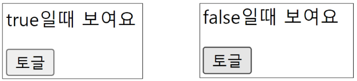
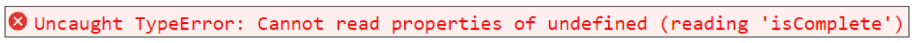
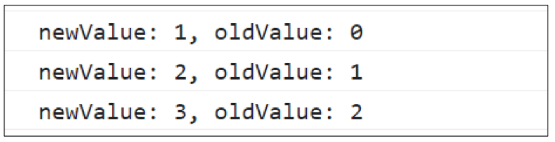

# Computed Property

## Computed
* Computed() : "계산된 속성"을 정의하는 함수
-> 미리 계산된 속성을 사용하여 템플릿에서 표현식을 단순하게 하고 불필요한 반복 연산을 줄임
### Computed 기본 예시
1. 
```javascript
// html
const todos = ref([
{text: 'Vue 실습'},
{text: '자격증 공부'},
{text: 'TIL 작성'}
])
```
```html:computed.html
<h2>남은 할 일</h2>
<p>{{ todos.length > 0 ? '아직 남았다' : '퇴근!' }}</p>
```
-> 템플릿이 복잡해지며 todos에 따라 계산을 수행하게 됨
-> 만약 이 계산을 템플릿에 여러 번 사용하는 경우에는 반복이 발생
2. 
* computed 적용
*  반응형 데이터를 포함하는 복잡한 로직의 경우 computed를 활용하여 미리 값을 계산하여 계산된 값을 사용
```javascript
// html
const { createApp, ref, computed } = Vue

const restOfTodos = computed(() => {
    return todos.value.length > 0 ? '아직 남았다':'퇴근!'
})
```
```html
<h2>남은 할 일</h2>
<p>{{ restOfTodos }}</p>

```
### Computed 특징
* 반환되는 값은 computed ref 이며 일반 refs와 유사하게 계산된 결과를 .value로 참조 할 수 있음 (템플릿에서는 .value 생략 가능)
* computed 속성은 의존된 반응형 데이터를 **자동으로 추적**
* 의존하는 데이터가 변경될 때만 재평가
    - restOfTodos의 계산은 todos에 의존하고 있음
    - 따라서 todos가 변경될 때만 restOfTodos가 업데이트 됨
```javascript
const restOfTodos = computed(() => {
    return todos.value.length > 0? '아직 남았다' : '퇴근!'
})
```

## Computed vs. Methods
### Computed와 동일한 로직을 처리할 수 있는 method
* computed 속성 대신 method로도 동일한 기능을 정의할 수 있음
@@@@@@@@@@@e다시 여기서 부터@@@@@@@@@@@@@@@p10
# Conditional Rendering
## v-if
* 표현식 값의 true/false를 기반으로 요소를 조건부로 렌더링
### v-if 예시
1. 'v-else' directive를 사용하여 v-if에 대한 else 블록을 나타낼 수 있음
    1. 
    2. 
    ```javascript
    // html:conditional-rendering.html

    const isSeen = ref(true)
    ```
    ```html:conditional-rendering.html
    <p v-if="isSeen">true일때 보여요</p>
    <p v-else>false일때 보여요</p>
    <button @click="isSeen = !isSeen">토글</button>
    ```
2. 'v-else-if' directive를 사용하여 v-if에 대한 else if 블록을 나타낼 수 있음
```js
const name = ref('Cathy')
```
```html
<div v-if="name === 'Alice'">Alice입니다</div>
<div v-else-if="name === 'Bella'">Bella입니다</div>
<div v-else-if="name === 'Cathy'">Cathy입니다</div>
<div v-else>아무도 아닙니다</div>
```

### 여러 요소에 대한 v-if 적용
* HTML template 요소에 v-if를 사용하여 하나 이상의 요소에 대해 적용 할 수 있음 (v-else, v-else-if 모두 적용 가능)
```html
<template v-if="name === 'Cathy'">
    <div>Cathy입니다</div>
    <div>나이는 30살입니다</div>
</template>
```

### HTML <template> element
* 페이지가 로드 될 때 렌더링 되지 않지만 JavaScript를 사용하여 나중에 문서에서 사용할 수 있또록 하는 HTML을 보유하기 위한 메커니즘
-> "보이지 않는 wrapper 역할"
@@@@@@@@@@@@@@@@p24


## v-if vs. v-show

# List Rendering

## v-for
* 소스 데이터를 기반으로 요소 또는 템플릿 블록을 여러 번 렌더링 (Array, Object, Number, String, Iterable)

### v-for 구조
* v-for는 alias in expression 형식의 특수 구문을 사용
```html
<div v-for="item in items">
    {{ item.text }}
</div>
```
* 인덱스(객체에서는 key)에 대한 별칭을 지정할 수 있음
```html
<div v-for="(item, index) in arr"></div>

<div v-for="value in object"></div>
<div v-for="(value, key) in object"></div>
<div v-for="(value, key, index) in object"></div>
```

### v-for 예시
1. 배열 반복
```js
// html:list-rendering.html

const myArr = ref([
    { name: 'Alice', age: 20 },
    { name: 'Bella', age: 21 }
])
```
```html
<div v-for="(item, index) in myArr">
    {{ index }} / {{ item }}
</div>
```
2. 객체 반복
```js
const myObj = ref({
    name: 'Cathy',
    age: 30
})
```
```html
<div v-for="(value, key, index) in myObj">
    {{ index }} / {{ key }} / {{ value }}
</div>
```

### 여러 요소에 대한 v-for 적용
* HTML template 요소에 v-for를 사용하여 하나 이상의 요소에 대해 반복 렌더링 할 수 있음
```html
<ul>
    <template v-for="item in myArr">
        <li>{{ item.name }}</li>
        <li>{{ item.age }}</li>
        <hr>
    </template>
</ul>
```

### 중첩된 v-for
* 각 v-for 범위는 상위 범위에 접근 할 수 있음
```js
const myInfo = ref([
    { name: 'Alice', age: 20, friends: ['Bella', 'Cathy', 'Dan'] },
    { name: 'Bella', age: 21, friends: ['Alice', 'Cathy'] }
])
```
```html
<ul v-for="item in myInfo">
    <li v-for="friend in item.friends">
        {{ item.name }} - {{ friend }}
    </li>
</ul>
```

## v-for with key
* 반드시 v-for와 key를 함께 사용한다
    * 내부 컴포넌트의 상태를 일관 되게 하여 데이터의 예측 가능한 행동을 유지하기 위함

### v-for와 key
* key는 반드시 각 요소에 대한 **고유한 값을 나타낼 수 있는 식별자**여야 함
```js
// v-for-with-key.html

let id = 0

const items = ref([
    { id: id++, name: 'Alice' },
    { id: id++, name: 'Bella' },
])
```
```html
<div v-for="item in items" :key="item.id">
    <!-- content -->
</div>
```

### 내장 특수 속성 key
* number 혹은 string으로만 사용해야 함
* Vue의 내부 가상 DOM 알고리즘이 이전 목록과 새 노드 목록을 비교할 때 각 node를 식별하는 용도로 사용
-> Vue 내부 동작 관련된 부분이기에 최대한 작성하려고 노력할 것
* https://vuejs.org/api/built-in-specital-attributes.html#key

## v-for with v-if
* 동일 요소에 v-for와 v-if를 함께 사용하지 않는다
    * 동일한 요소에서 v-if가 v-for보다 우선순위가 더 높기 때문
    -> v-if에서의 조건은 v-for 범위의 변수에 접근할 수 없음

### v-for와 v-if 문제 상황
1. todo 데이터 중 이미 처리 한(isComplete === true) todo 만 출력하기
```js
// v-for-with-v-if.html

let id = 0

const todos = ref([
    { id: id++, name: '복습', isComplete: true },
    { id: id++, name: '예습', isComplete: false },
    { id: id++, name: '저녁식사', isComplete: true },
    { id: id++, name: '노래방', isComplete: false }
])
```

2. v-if가 더 높은 우선운위를 가지므로 v-for 범위의 todo 데이터를 v-if에서 사용할 수 없음
```html
<ul>
    <li v-for="todo in todos" v-if="!todo.isComplete" :key="todo.id">
        {{ todo.name }}
    </li>
</ul>
```



### v=for와 v-if 해결법 2가지
1. computed 활용
    * **computed를 활용해 필터링 된 목록을 반환하여 반복**하도록 설정
    ```js
    const completeTodos = computed(() => {
        return todos.value.filter((todo) => !todo.isComplete)
    })
    ```
    ```html
    <ul>
        <li v-for="todo in completeTodos" :key="todo.id">
            {{ todo.name }}
        </li>
    </ul>
    ```

2. v-for와 <template>요소 활용
    * v-for와 template 요소를 사용하여 **v-if 위치를 이동**
    ```html
    <ul>
        <template v-for="todo in todos" :key="todo.id">
            <li v-if="!todo.isComplete">
                {{ todo.name }}
            </li>
        </template>
    </ul>
    ```
# Watchers

## watch
* watch() : 하나 이상의 반응형 데이터를 감시하고, 감시하는 데이터가 변경되면 콜백 함수를 호출

### watch 구조
```js
watch(source, (newValue, oldValue) => {
    // do something
})
```
* 첫번째 인자 (source)
    - watch가 감시하는 대상 (반응형 변수, 값을 반환하는 함수 등)
* 두번째 인자 (callback function)
    - source가 변경될 때 호출되는 콜백 함수
    1. newValue
        * 감시하는 대상이 변화된 값
    2. oldValue (optional)
        * 감시 하는 대상의 기존 값

### watch 기본 동작
```html:watcher.html
<button @click="count++">Add 1</button>
<p>Count: {{ count }}</p>
```
```js
const count = ref(0)

watch(count, (newValue, oldValue) => {
    console.log(`newValue: ${newValue}, oldValue: ${oldValue}`)
})
```


### watch 예시
* 감시하는 변수에 변화가 생겼을 때 연관 데이터 업데이트하기
1. 

## computed vs. watch
# Lifecycle Hooks
# Vue Style Guide
