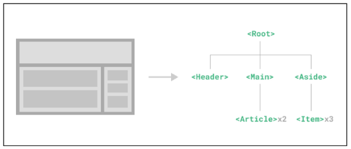

# Single-File Components

## Component
* 재사용 가능한 코드 블록
### Component 특징
* UI를 독립적이고 재사용 가능한 일부분으로 분할하고 각 부분을 개별적으로 다룰 수 있음
-> 자연스럽게 애플리케이션은 중첩된 Component의 트리 형태로 구성됨


### Single-File Components(SFC)
컴포넌트의 템플릿, 로직 및 스타일을 하나의 파일로 묶어낸 특수한 파일 형식(*.vue 파일)
### SFC 파일 예시
* Vue SFC는 HTML, CSS 및 JavaScript를 단일 파일로 합친 것
* < template >, < script > 및 < style > 블록은 하나의 파일에서 컴포넌트의 뷰, 로직 및 스타일을 독립적으로 배치
```vue
<template>
    <div>
        <p class='greeting'>{{ msg }}</p>
    </div>
</template>

<script setup>
import {ref} from 'vue'

const msg = ref('Hello')


</script>


<style scoped>
.greeting {
    color: crimson;
}
</style>  
```
* 템플릿의 위치는 중요하지 않음 위로 가도 되고 아래로 가도 된다.

## SFC 문법

### SFC 문법 개요
* 각 *.vuye 파일은 세 가지 유형의 최상위 언어 블록 < template >, < script >, < style >으로 구성됨
-> 언어 블록의 작성 순서는 상관 없으나 일반적으로 template -> script -> style 순서로 작성

### 언어 블록 - < template>
* 각 *.vue 파일은 최상위 < template> 블록을 하나만 포함할 수 있음

### 언어 블록 - < script setup>
* 각 *.vue 파일은 < script setup> 블록을 하나만 포함할 수 있음 (일반 < script> 제외)
* 컴포넌트의 setup() 함수로 사용되며 컴포넌트의 각 인스턴스에 대해 실행
-> 변수 및 함수는 동일한 컴포넌트의 템플릿에서 자동으로 사용 가능
# SFC build tool
## Vite
* 프론트 엔드 개발 도구
-> 빠른 개발 환경을 위한 빌드 도구와 개발 서버를 제공 https://vitejs.dev/

### Build
* 프로젝트의 소스 코드를 최적화하고 번들링하여 배포할 수 있는 형식으로 변환하는 과정
* 개발 중에 사용되는 여러 소스 파일 및 리소스(javaScript, CSS, 이미지 등)를 최적화된 형태로 조합하여 최종 소프트웨어 제품을 생성하는 것

-> Vite는 이러한 빌드 프로세스를 수행하는 데 사용되는 도구
## NPM
## 모듈과 번들러
# Vue 프로젝트
## 프로젝트 구조
# Vue Component 활용
# 추가 주제
## Virtual DOM
## Composition API & Option API