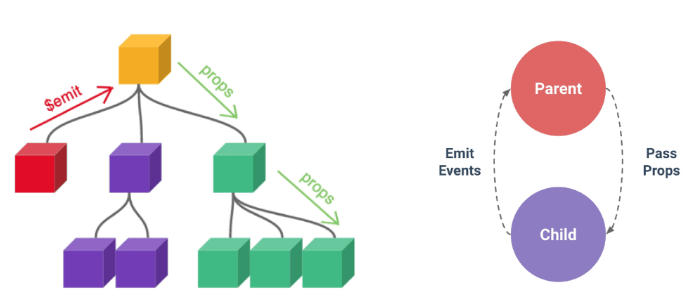

# Passing Props
## Props
### 같은 데이터 하지만 다른 컴포넌트
* 동일한 사진 데이터가 한 화면에 다양한 위치에서 여러 번 출력되고 있음
* 하지만 해당 페이지를 구성하는 컴포넌트가 여러 개라면 각 컴포넌트가 개별적으로 동일한 데이터를 관리해야 할까?
* 그렇다면 사진을 변경 해야 할 때 모든 컴포넌트에 대해 변경 요청을 해야 함
=> "공통된 부모 컴포넌트에서 관리하자"

* 부모는 자식에게 데이터를 전달(Pass Props)하며, 자식은 자신에게 일어난 일을 부모에게 알림 (Emit event)

* Props: 부모 컴포넌트로부터 자식 컴포넌트로 데이터를 전달하는데 사용되는 속성
### Props 특징
* 부모 속성이 업데이트되면
## Props 선언
* Props 선언: 부모 컴포넌트에서 내려 보낸 Props를 사용하기 위해서는 자식 컴포넌트에서 명시적인 props 선언이 필요
## Props 세부사항
## Props 활용

# Component Events
## Emit
## 이벤트 발신 및 수신
## emit 이벤트 선언
## 이벤트 전달
## 이벤트 세부사항
## emit 이벤트 활용
