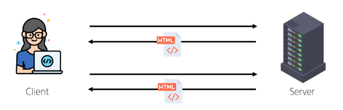
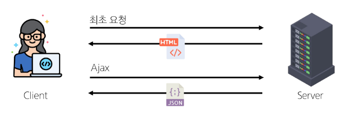
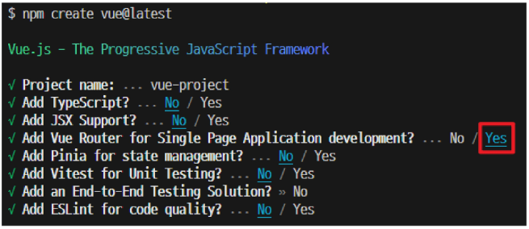
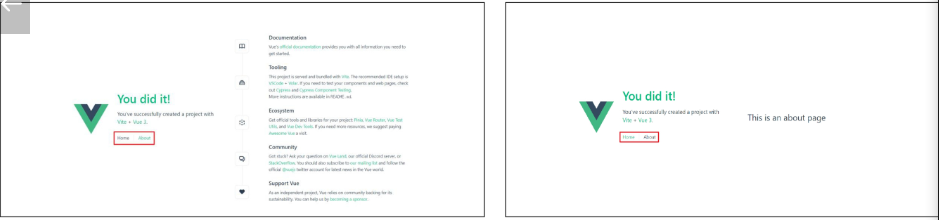
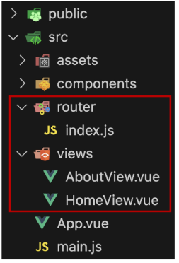
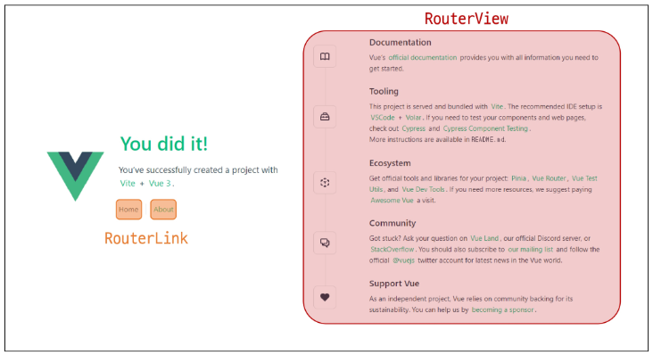
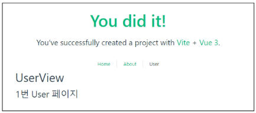
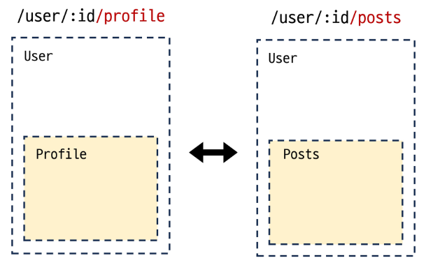

# Routing
URL을 이용해서 원하는 경로를 보여준다
## 개요
* Routing: 네트워크에서 경로를 선택하는 프로세스
=> 웹 애플리케이션에서 다른 페이지 간의 전환과 경로를 관리하는 기술
### SSR에서의 Routing

* SSR에서 routing은 서버 측에서 수행
* 서버가 사용자가 방문한 URL 경로를 기반으로 응답을 전송
* 링크를 클릭하면 브라우저는 서버로부터 HTML 응답을 수신하고 새 HTML로 전체 페이지를 다시 로드

### CSR에서의 Routing

* CSR에서 routing은 **클라이언트 측**에서 수행
* 클라이언트 측 JavaScript가 새 데이터를 동적으로 가져와 전체 페이지를 다시 롣 하지 않음

### SPA에서 Routing이 없다면
* 유저가 URL을 통한 페이지의 변화를 감지할 수 없음
* 페이지가 무엇을 렌더링 중인지에 대한 상태를 알 수 없음
    - URL이 1개이기 때문에 새로 고침 시 처음 페이지로 되돌아감
    - 링크를 공유할 시 첫 페이지만 공유 가능
* 브라우저의 뒤로 가기 기능을 사용할 수 없음

=> 페이지는 1개이지만, 주소에 따라 여러 컴포넌트를 새로 렌더링하여 마치 여러 페이지를 사용하는 것처럼 보이도록 해야 함


# Vue Router
## 개요
* Vue Router: Vue 공식 라우터 (The official Router for Vue.js)
[!https://router.vuejs.org/]
### 사전 준비
* Vite로 프로젝트 생성 시 Router 추가

* 서버 실행 후 Router로 인한 프로젝트 변화 확인
  => Home, About 링크에 따라 변경되는 URL과 새로 렌더링 되는 화면


### Vue 프로젝트 구조 변화
1. App.vue 코드 변화
2. router 폴더 신규 생성
3. views 폴더 신규 생성


### RouterLink
* 페이지를 다시 로드 하지 않고 URL을 변경하여 URL을 변경하여 URL 생성 및 관련 로직을 처리
* HTML의 <a> 태그를 렌더링
```vue:App.vue
<template>
  <header>
    <nav>
      <RouterLink to="/">Home</RouterLink>
      <RouterLink to="/about">About</RouterLink>
    </nav>
  </header>
  
  <RouterView />
</template>
```

### RouterView
* **RouterLink** URL에 해당하는 컴포넌트를 표시
* 원하는 곳에 배치하여 컴포넌트를 레이아웃에 표시 할 수 있음

### RouterLink와 RouterView


### router/index.js
* 라우팅에 관련된 정보 및 설정이 작성 되는 곳
* router에 URL과 컴포넌트를 매핑

### views
* RouterView 위치에 렌더링 할 컴포넌트를 배치
* 기존 components 폴더와 기능적으로 다른 것은 없으며 단순 분류의 의미로 구성됨

=> **일반 컴포넌트와 구분하기 위해 컴포넌트 이름을 View로 끝나도록 작성하는 것을 권장**

## Basic Routing
### 라우팅 기본
1. index.js에 라우터 관련 설정 작성(주소, 이름, 컴포넌트)
```js:index.js
const router = createRouter({
  routes: [
    {
      path: '/',
      name: 'home',
      component: HomeView
    }
  ]
})
```
2. RouterLink의 'to' 속성으로 index.js에서 정의한 주소 값(path)을 사용
```vue:App.vue

<RouterLink to = "/">Home</RouterLink>
<RouterLink to="/about">About</RouterLink>
```
3. RouterLink 클릭 시 경로와 일치하는 컴포넌트가 RouterView에서 렌더링 됨
```js:App.vue
<RouterView />
```

## Named Routes
* 경로에 이름을 지정하는 라우팅
[!https://router.vuejs.org/guide/essentials/named-routes.html]

### Named Routes 예시
* name 속성 값에 경로에 대한 이름을 지정
* 경로에 연결하려면 RouterLink에 v-bind를 사용해 'to' props 객체로 전달
```js:index.js
const router = createRouter({
  routes: [
    {
      path: '/',
      name:'home',
      component:HomeView
    }
    ...
  ]
})
```
```vue:App.vue
<RouterLink :to="{ name: 'home' }">Home</RouterLink>
<RouterLink :to="{ name: 'about' }">About</RouterLink>
```

### Named Routes 장점
* 하드 코딩 된 URL을 사용하지 않아도 됨
* URL 입력 시 오타 방지

## Dynamic Route Matching
* URL의 일부를 변수로 사용하여 경로를 동적으로 매칭
[!https://router.vuejs.org/guide/essentials/dynamic-matching.html]

### 매개변수를 사용한 동적 경로 매칭
* 주어진 패턴 경로를 동일한 컴포넌트에 매핑 해야 하는 경우 활용
* 예를 들어 모든 사용자의 ID를 활용하여 프로필 페이지 URL을 설계한다면?
    - user/1
    - user/2
    - user/3
    => 일정한 패턴의 URL 작성을 반복해야 함

### 매개변수를 사용한 동적 경로 매칭 활용
1. views 폴더 내 UserView 컴포넌트 작성
```vue:UserView.vue
<template>
  <div>
    <h1>UserView</h1>
  </div>
</template>
```

2. 매개변수는 콜론(":")으로 표기
    => UserView 컴포넌트 라우트 등록
```js:index.js
import UserView from '../views/UserView.vue'

const router = createRouter({
  routes: [
    {
      path: '/user/id',
      name: 'user',
      component: UserView
    }
  ]
})
```

3. 매개변수는 객체의 params 속성의 객체 타입으로 전달
    * 단, 객체의 key 이름과 index.js에서 지정한 매개변수 이름이 같아야 함
    => UserView 컴포넌트로 이동하기 위한 RouterLink 작성
```js:App.vue
import {ref} from 'vue'

const userId = ref(1)

<RouterLink :to="{name: 'user', params: {'id': userId}}">User</RouterLink>
```

4. 경로가 일치하면 라우트의 매개변수는 컴포넌트에서 **$route.params**로 참조 가능
    => 현재 사용자의 id를 출력하기
  ```vue:UserView.vue
  <template>
    <div>
      <h1>UserView</h1>
      <h2>{{ $route.params.id }}번 User 페이지</h2>
    </div>
  </template>
  ```



5. useRoute() 함수를 사용해 스크립트 내에서 반응형 변수에 할당 후 템플릿에 출력하는 것을 권장
    * 템플릿에서 $route를 사용하는 것과 동일

```js:UserView.vue
import { ref } from 'vue'
import { useRoute } from 'vue-router'

const route = useRoute()
const userId = ref(route.params.id)
```

```vue:UserView.vue
<template>
  <div>
    <h1>UserView</h1>
    <h2>{{ userId }}번 User 페이지</h2>
  </div>
</template>
```

## Nested Routes
* 중첩된 라우팅
[!https://router.vuejs.org/guide/essentials/nested-routes.html/#Nested-Routes]


* 애플리케이션의 UI는 여러 레벨 깊이로 중첩된 컴포넌트로 구성되기도 함
* 이 경우 URL을 중첩된 컴포넌트의 구조에 따라 변경되도록 이 관계를 표현할 수 있음


## Programmatic Navigation

# Navigation Guard
## Globally Guard
## Per-route Guard
## In-component Guard