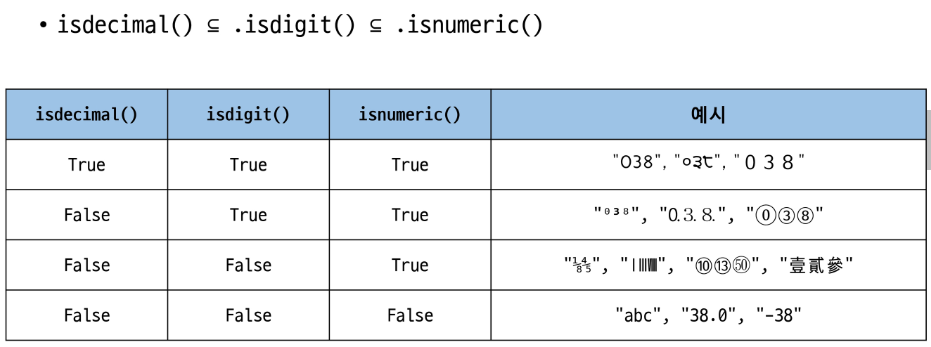

# 자료구조 (Data Structure)
* 여러 데이터를 효과적으로 사용, 관리하기 위한 구조(str, list, dict ...)
## 데이터 구조 활용
* 문자열 리스트 딕셔너리 등 각 데이터 구조의 메서드를 호출하여 다양한 기능 활용하기
문제 풀 때 굉장히 중요
순차, 연결 이런 것은 나중에 선형 구조인 deque 이런 거 알고리즘으로 풀 때 자연스럽게 import해서 사용가능
비선형도 알고리즘에서 다루게 됨
이 중 중요한 건 리스트, 스택, 큐, 트리, 그래프
단순 구조와 함께 이것들이 중요함
문제를 풀 때 마다 필요한 자료구조가 다르니 다 정리해두고 있어야 함

## 메서드
객체에 속한 함수
-> 객체의 상태를 조작하거나 동작을 수행

메서드는 함수인데 객체에 속한 함수
* 함수인데 클래스 내부에 정의된 것
* 매서드는 어딘가에 속해 있지만 지금까지 우리가 작성한 함수는 단독적으로 존재함
* 이 어딘가에 속해있는 객체(클래스)라는 개념이 등장함
* 그 클래스의 생성된 객체가 호출할 수 있는 함수를 매서드라고함
* 해당 객체에서만 사용할 수 있고 다른 곳에서는 사용할 수 없음
(ex) 문자열 문자열객체.메서드() 이렇게 호출
  * capitalize는 첫 글자만 대문자
  * append는 제일 뒤에 추가 (문자열에는 append가 정의 되어있지 않아서 사용 불가능하고, list에서만 사용이 가능)
=> 지금 시점에 알아야할 것은 매서드는 어딘가(클래스)에 속해있는 **함수**이며, 각 데이터 타입별로 다양한 기능을 가진 메서드가 존재

## Class
python에서 타입 표현 방법
(help로 디테일하게 볼 수 있음.)
* __ 이런식으로 써지는 애들을 매직 메서드라고 함
우리가 직접 활용하는 경우는 많이 없음
* 일반 함수는 함수이름() 으로 함수호출을 하는데
메서드는 리스트.append() 이런식으로 호출한다
* 객체.메서드()
* 메서드는 어딘가(클래스)
* append는 리스트의 마지막 요소로 ()내부에 있는 것을 추가시켜주는것

## 시퀀스 데이터 구조
### 문자열
문자열의 특징: 시퀀스의 특징을 가지고 iterabl하고 **불변**
1. s.find(X): x 의 첫번째 위치를 반환하는데 없으면 -1 반환
2. s.index(x): x의 첫번째 위치를 반환하는데 없으면 error 가 뜸
3. is~~라고 시작하는 형태: 결과가 T/F 형태가 리턴
    * s.usalpha():알파벳 문자 여부, 단순 알파벳이 아닌 유니코드 상 letter로 한국어 포함 
4. isuper 와 islower: 모두 대문자 소문자로 이루어져있음

#### 문자열 조작 매서드(새 문자열 반환)
조작: 수정, 생성, 삭제...
1. s.replace (old,new[,count])
문자열은 새문자열을 주는데 원본이 아니라 새 문자열을 줌
원본이 불변이라 새로운 데이터를 주는 것
  * [,count] 이러한 인자 표현 방식은 배운적이 없는데, 이런식으로 쓰면 문법 에러가 남, 이건 파이썬 문법이 아님
  * 공식 문서를 보면 메서드 표기 할때 저런식으로 표기를 함. 세 번째 인자를 이야기 함. 세번 째 인자가 선택인자
    * 즉 저 대괄호 의미는 선택인자를 의미 선택적으로 넣을 수 도 있고, 안 넣을수도 있음

  * 문법으로 존재하지도 않는데 왜 저렇게?
    * 왜냐 프로그래밍 언어가 파이썬만 있는건 아니기 때문. 굉장히 많은 프로그래밍 언어가 존재하고 모두 다 언어가 근본적으로 크게 다르지는 않아 이 프로그래밍 언어도 각자의 문법을 정리한 문서가 있음.
  * 이걸 언어별로 다르게 하지말고 다 공통으로 수학적으로 표기법을 하나 만들자 해서 이렇게 바로 알 수 있도록 어떤 프로그래밍 언어 개발자가 와도 알수있도록 보기 편하게 만든 것.
  이런 표기법 이름은 **베커스_나우르 표기법**이라고 함
    * 이걸로는 표기가 어려워서 +알파인 extend라고 함. 약칭 BNF
    * extended_backus_naur: 대괄호를 넣으면 넣을수도 있고 안 넣을 수 도있다 이런식으로 통일하고 만든 문법.

2. strip: 문자열 시작과 끝의 공백 혹은 지정한 문자 제거
3. split: 기본으로 들어갈때 기본값이 None 이라 공백을 기준으로 분류한다는 것 구분자를 스페이스 기준으로 list로 분리
4. join: 앞쪽에 구분자가 나오고 '구분자'.join(iterable) 이런 형식으로 진행.
split과 반대로 이 두개의 문자열을 하나의 요소로 합치겠다는 의미
* 만약 앞쪽 매서드의 반환 값이 None이라면 이어갈 수 없어서 에러가 뜸.
 
### None type
None 타입은 이러한 메소드를 가지고 있지 않다.


---
### list
가변, 변경 가능한 데이터 타입으로 원본을 변경할 수 있음.
#### 값 추가 및 삭제 메서드
* 원본을 바꾸는 결과를 내는 메소드는 리턴 값이 없음.
  * 추가
  1. append: 리스트 마지막에 추가
  2. extend: iterable한 걸 리스트 마지막에 추가
  3. index: 문자열의 find와 비슷함. 
  4. insert: 특정 인덱스에 삽입
  
  * 삭제
  5. remove(x): 가장 왼쪽에 있는 항목의 첫 x를 제거,하지만 없으면 error를 내서 잘 사용하지 않고, 주로 pop을 이용해서 제거
  6. pop: 기본적으로 값을 안 넣으면 마지막 값을 뺌, 오른쪽 마지막에 있는 항목을 반환하고 제거
    * pop 아주 중요, append 와 반대라 자주 쓰임
    * pop(i): i에 있는 항목을 반환하고 제거, 특정 인덱스에 있는 항목을 삭제하는데 그 항목을 꺼내고 삭제
    이건 반환이 있어서 프린트 하면 뺀 값이 나온다.
  7. clear: 전체 삭제, 초기화. 원래 있던 주소는 그대로 쓰는데 내부를 비우는 거고, my_list=[] 이런식으로 하는 건 새롭게 할당하는 것

* 찾거나 정렬
1. count(x): x의 갯수를 세는 것
2. reverse: 순서를 뒤집는 것 정렬이 아님, 반환 값이 없는 원본을 바꾸는 것
3. sort: 정렬, sort 반환값이 none. 원본을 바꾸는 녀석이라 반환이 없음
  * 원래는 오름차순인데 false값으로 기본값이 설정된 것, 내림으로 하고 싶다면 true로 주면 됨
  * sorted(리스트)이런 내장함수가 있음, 리스트 외에 다른 iterable, sequectial한 객체를 정렬, 누구나 호출 가능, 문자열도 정렬해줌, 원본을 변경 안하기 때문에 반환값이 있음


---
# 데이터 타입과 복사
* 파이썬은 데이터의 분류에 따라 복사 방식의 차이가 있음
* 프로그램에서는 데이터 타입에 따라서 두 개가 안 될 수 도 있음
변경 가능한 데이터 타입과 변경 불가능한 데이터 타입에 따라서 사람이 생각하는것과 다를 수 있음
* 변경 가능한 것은 이상하게 동기화가 되어버림
* 가변과 불면은 다름
  * 불변은 새로운 주소를 줘야해서 못 바꾸는데
  * 가변은 새로운 주소를 안 줘서 바꿀 수 있음


## 변경 가능한 데이터 타입의 복사
* 대표: 리스트
  
## 복사의 3가지 유형
파이썬 뿐만 아니라 다른 언어도 같음
1. 할당
  * a=b처럼 객체를 참조하여 복사
  * 리스트의 메모리 주소를 복사해서 사용
  * 리스트 복사는 정말 중요
2. 얕은복사
  1. 슬라이싱: 슬라이싱을 하게 되면, 원본을 복사하는 게 아니라 슬라이싱해서 나온 결과를 새롭게 생성하여 새로운 리스트를 반환
     * 주소가 완전히 다르다는 의미
  
  2. 얕은 복사의 한계: 이차원 구문에서는 내부 리스트의 주소가 같아서 같이 바뀜
  * 리스트 속 리스트의 경우 슬라이싱으로 새로 만들어도 리스트 속 리스트는 값이 들어간 것 같지만 리스트의 주소가 들어간 것이기 대문에 얕은 슬라이싱을 해도 결국 연동된다.
  * 주소값이 복사되기 때문에 결국 같은 집을 가르키는 그 집에서 사람이 들어가는 그런 것
  * 해결을 위해 깊은 복사를 함
3. 깊은 복사
   ```python
   import copy
   copy.deepcopy()
   ```
  * copy라는 내장 모듈을 사용
  * 이차원 리스트에서 지도 정보가 있고, 해당 정보를 마스킹하며 가는데 원본도 따로 필요하다면, 그냥 수정하면 비교할 대상이 없어지는데 이럴 때는 같은 주소를 deepcopy로 만들어 줘야 비교대상이 수정이 되지 않음
  * 내부 중첩된 모든 객체까지 새로운 값을 가지게 됨
  * 리스트는 주소 값의 나열: 바라보고 있는 주소 값은 변화지 않기 때문
  * 모습같고 주소 같은게 아니라
  * 모습같고 주소 다른 다른 리스트를 만나고 싶다, 이건 얕은 복사라고 함

# 참고
문자열에 포함된 문자들의 유형을 판별하는 메서드
* isdecimal()
    * 문자열이 모두 숫자 문자(0~9)로만 이루어져 있어야 True
* isdigit()
    * isdecimal()과 비슷하지만, 유니코드 숫자도 인식('①')
