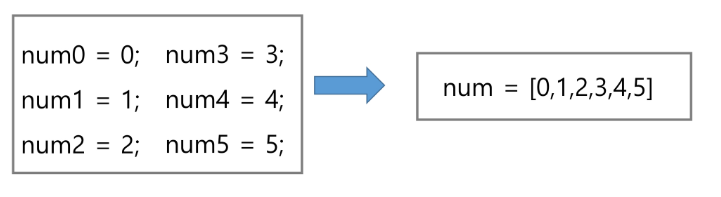

## 알고리즘
알고리즘: 문제를 해결하기 위한 절차나 방법

알고리즘을 표현하는 두 가지 방법
* 슈도코드와 순서도가 있음
* 우리는 슈도와 파이썬 중간 어딘가를 왔다리 갔따리 할 예정
* APS 목표는 보다 좋은 알고리즘을 이해하고 활용
  1. 정확성
  2. 작업량
  3. 메모리 사용량
  4. 단순성
  5. 최적성

* 잘 알려진 알고리즘을 잘려진 문제에 적용할 수 있는가

### 시간복잡도: 알고리즘의 작업량을 표현할 때
* 실제 걸리는 시간 측정
* 실행되는 명령문의 개수를 계산

#### 빅-오(O) 표기법
* 시간복잡도 함수 중 가장 큰 영향력 주는 n에 대한 항만 표시
* 0차(그냥 일반 정수나 숫자만 N이 없이 있는)는 1로 표기
* 계수를 제거한 최고차항 만 표기
3n2+2 --> n2
n! > 2^n > n^2 > n*logn > n > logn > 0차

### 배열
* 일정한 자료형의 변수들을 하나의 이름으로 열거하여 사용하는 자료 구조
* 6개의 변수를 사용해야 하는 경우, 이를 배열로 바꾸어 사용하는 예

메모리의 어드레스...?

#### 배열의 필요성
* 프로그램 낸에서 여러 개의 변수가 필요할 때, 일일이 다른 변수명을 이용하여 자료에 접근하는 것은 매우 비효율적일 수 있다.
* 배열을 사용하면 하나의 선언을 통해서 둘 이상의 변수를 선언할 수 있다.
* 단순히 다수의 변수 선언을 의미하는 것이 아니라, 다수의 변수로는 하기 힘든 작업을 배열을 활용해 쉽게 할 수 있다.

#### 1차원 배열
* 1차원 배열의 선언
  * 별도의 선언 방법이 없으면 변수에 처음값을 할당할 때 생성
  * 이름 : 프로그램에서 사용할 배열의 이름

* 1차원 배열의 접근
  * Arr[0] = 10 # '배열 Arr의 0번 원소에 10을 저장하라'
  * Arr[idx] = 20 # '배열 Arr의 idx번 원소에 20을 저장하라'

### 버블 정렬
* 2개 이상의 자료를 특정 기준에 의해 작은 값-> 큰 값(오름차순:ascending), 혹은 그 반대의 순서대로(내림차순:descending) 재배열하는 것
* 키: 자료를 정렬하는 기준이 되는 특정 값
이접한 두개의 원소를 비교하며 자리를 계속 교환하는 방식
