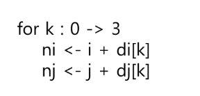
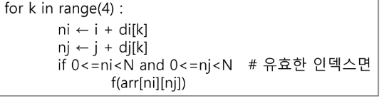

2차원배열에서 배열은 8기 까지는 엄청 나왔ㄴ는데 9기 부터 드물지만 2차원배열은 안나오넉 없으니 꼭...

접근[밖인덱스 행][안인덱스 열]

2차원 배열을 인풋으로 받는다면

2차원 배열인 경우에는 보통 배열의 크기가 주어지거나 고정이 되어있음

배열의 크기만큼 줄 수가 주어진다.
스페이스바가 있으면 .split() 다 붙어있으면 쓰지 말고
list comprehension을 쓰면 for_in range(N):
빈 리스트에 append를하면 

순회는??
중요중요

첫 행의 열을 하나씩 하나씩 순회하는 것
rc raw col 로 쓰는걸 더 선호하신다함

행우선 순회는 가장 밖에 있는 반복문이 행을 의미하고 안쪽에 있는 반복문이 열 반복을 하게 된다.

열 우선 순회는 
가장 밖에 있는 반복문이 열 반복이 되고
안에있는게 행 반복이된다.

### 지그재그 순회
???????????????????
달팽이 순회도 할 수 있음
? 사람살려

순회
행 우선 순회
열 우선 순회는 반드시 기억하고 대각선까지 같이 기억하면 좋다

좌측 상단에서 우측 하단 방향으로 대각선이 흘러가는건
행열 번호가 같음 그럼 반복은 하나만 있어도 됨
arr[i][i]
반대로 오는건???
2[i][N-1-i]

### 델타도 중요 중요
특정 위치에서 상하좌우에 대한 정보를 확인
미로찾기는 실제 내 위치를 이동하며 바꿔야함
그럴때 사용하는게 요 델타탐색

nj 이동 탐색 좌표
j 현재 좌표
dj 이동좌표

델타에서는 인덱스가 유효한지 반드시!!!!체크해야함
결과가 인덱스 범위 내에있는지 반드시 체크...!

원리?
원리를 기준으로 나를 기준으로 위로 두칸 밑으로 두칸 좌우로 두칸씩 있는 값을 문제로 오늘 풀 것...
흑흑흑
이해해...
제발...

zip함수로 하면

이 긴식이
이거 한줄로 바꿀수 있음
`list(zip(*arr))`
같은 index끼리 묶어서 반환
신기방기

부분집합을 포문 이용하여 유연하지 않은 코드인게 원소가 늘거나 줄으면 못쓰는 코드
포문을 중첩하는건 유연하지 못하다 라는걸 알고있걸아...
그럼 유연한건??
재귀를 활용해서 만든다

비트연산자
1바이트는 1 비츠
1 바이트는 2의 8승까지 표현
4바이트는 32승까지 가능

하나의 값이 너무 크면 예를들면 4바이트제한이라고 하면 너무 큰값이 들어가 overflow라고 한다

쉬프트 연산자 이걸 이동시키는건??
범위를 넘어가면 없어진다 1>>3 은 2**0인데 1이 범위를 넘어가서 0이되어버린다

1을 우측으로 시프트 하면 10이 되어버림
쉬프트를 하면 2의 배수가 되더라....
111&100 결과는 100
010 &100 결과는 000
일치하는 비트가 하나도 없기 때문
j 0~2 반복
i=2
2&(1<<j)결과는?
0
0번 시프트는 본인이기 때문에 1
결과는 10&01이라 0
1
1번 시프트는 2**1
10&10 결과 2
2
2번 시프트는 
010 &100 결과 0

부분집합에서 저거를 사용했는데 집중할것은 j를 인덱스로 사용을 한다는게 중요함
숫자가 2일때 arr=[1,2,3]
이 있을때 i=2 부분집합의 경우의 수
비트연산을 통해서 어떤 인덱스의 값을 사용할지 확인을 하는 것
i=3 
j 0 1 2
결과 1 2 0
arr = [1,2,3]일 경우에
(1,2)를 부분집합으로 사용하겠다
라는 의미
j의 인덱스와 배열의 길이가 맞아야 사용할 수 있을 것 같다
 배열 인덱스의 어떤 값을 뽑을 건지 정하는 것 
 만약 i가 4였다면 3만 나온당
1<<N == 2**n

하지만 비트연산자로 활용하고자 하니까 이렇게 쓴다
이걸 왜쓰냐
c에서 겁나 빠르게 돈다
이걸 이용해 모든 부분집합을 출력 가능
길이가 얼마든 모든 부분집합 갯수 출력 가능

연습문제 부분집합의 합 구현하기

코드를 참고하여 해도 괜찮음 흑흑 너무 어려워 ㅠㅠ
