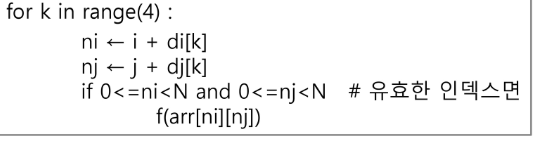

## 배열 2 (Array 2)
* 2 차원 배열이란?

한 줄이 아니고 쌓아놓는 모양

계란판 계란 한줄로 비교하심

자료구조상에서 배열 Array라는 표현을 쓴다.
파이썬에서는 List라는걸 구현함
1차원은 arr[0]이런거
2차원은 arr[0][0]
이런식으로 씀
2차원까지만 쓰고 보통 3차원은 잘 안쓰는데 복잡해질 위험이 크기 때문
접근[밖인덱스 행][안인덱스 열]
배열의 크기만큼 줄 수가 주어진다.
스페이스바가 있으면 .split() 다 붙어있으면 쓰지 말고
list comprehension을 쓰면 for_in range(N):
빈 리스트에 append를하면 


* 2차원 List의 선언
행(i,r): 몇 개의 층인가?
열(j,c): 그 층에 몇 번째 자리?
(보통 변수이름이 저 알파벳임)

여기서 1차원 리스트 하나가 행이 되는 것

아직은 그냥 2차원을 준건 2차원으로 받는 수준이지만 나중에 익숙해지면 아예 1차원을 2차원으로 나눠서 주기도 함

for _ in range(N)
큰 의미 없이 그냥 횟수만 지정하면 되는 경우에는 _ 이렇게 하면된다
_는 특별한게 아니고 그냥 변수명

### 배열 순회
* 배열 순회: n x m 배열의 n x m 개의 모든 원소를 빠짐없이 조사하는 방법

행우선 순회는 가장 밖에 있는 반복문이 행을 의미하고 안쪽에 있는 반복문이 열 반복을 하게 된다.

* 행 우선 순회
    i 행의 좌표
    j 열의 좌표
```python
for i in range(n):
    for j in range(m):
        f(array[i][j]) #필요한 연산 수행
```
맨 처음 행(i)가 0으로 고정된 상태로 열(j)가 순서대로 순회함

저기 안에서 또 내부에서만 돌아야 하면 r,c 이렇게 돈다
이거 별찍기에 쓸수있을듯!

열 우선 순회는 
가장 밖에 있는 반복문이 열 반복이 되고
안에있는게 행 반복이된다.
* 열 우선 순회
    * i 행의 좌표
    * j 열의 좌표

```python
for j in range(m)
    for i in range(n)
        f(array[i][j])
```
먼저 고정시킨 애를 뒤로 써놓으면 열 우선 순회가 된다.

* 지그재그 순회
(ex) 달팽이 순회
    * i 행의 좌표
    * j 열의 좌표
```python
for i in range(n): 
    """
     for i:0->N-1
     if: %2 ==0
     for j:0->M-1 arr[i][j]
     else
     for j:M-1->0
     arr[i][j]
    """ 


    for j in range(m)
        f(array[i][j+(m-1-2*j)*(i%2)])
```
(m-1-2*j)가 저 식이 거꾸로 갈 수 있게해주는 근원인데 이 식은 짝수 행에서는 원래대로 가고 홀수에서는 거꾸로 가야하기 때문에 짝수가 될 경우 저 식 부분을 날려야 한다.
때문에 i%2 로 짝 홀수를 줌

* 델타를 이용한 2차 배열 탐색
    * 각 원소에 접근하고 그 옆에 있는 애들 좀 살펴 볼래?
    이런식의 접근방법
    기존에는 본인만 탐색했다.
    * 2차 배열의 한 좌표에서 4방향의 인접 배열 요소를 탐색하는 방법
    * 인덱스 (i,j) 인 칸의 상하좌우 칸(ni,nj)
    di[]<- [0,1,0,-1] 
    이거 파리잡기에 쓸 수 있을 듯


### 델타도 중요 중요
특정 위치에서 상하좌우에 대한 정보를 확인
미로찾기는 실제 내 위치를 이동하며 바꿔야함
그럴때 사용하는게 요 델타탐색

nj 이동 탐색 좌표
j 현재 좌표
dj 이동좌표

델타에서는 인덱스가 유효한지 반드시!!!!체크해야함
결과가 인덱스 범위 내에있는지 반드시 체크...!


뭔가 짝지어서 di dj에 짝지어서 아래 위 양 옆 총4개 가 짝지어진 ij??? 
뭔소리지
문제풀면 이해될까?

순회
행 우선 순회
열 우선 순회는 반드시 기억하고 대각선까지 같이 기억하면 좋다

좌측 상단에서 우측 하단 방향으로 대각선이 흘러가는건
행열 번호가 같음 그럼 반복은 하나만 있어도 됨
arr[i][i]
반대로 오는건???
2[i][N-1-i]

--- 쉬는 시간...
무작정 4방향으로 계산하면
어라 벗어나는데 이런 상황해결을 위해 if 문을 넣을 수 있음
뭔지 겁나 모르겠다 뭐라는 거지
???????
이건 문제를 풀어봐야할까???

### 전치행렬
i: 행의 좌표, len(arr)
j: 열의 좌표, len(arr[0])
```python
arr = [[1,2,3],[4,5,6],[7,8,9]] # 3*3 행렬

for i in range(3):
    for j in range(3):
        if i < j:
            arr[i][j], arr[j][i] = arr[j][i], arr[i][j]
```
전치행렬: 대각선 기준으로 대칭되는 걸 바꾸는 것
양쪽 다 돌면 결국 같으니까 대각선 기준으로 한쪽기준으로 만 바꾼다 라는 의미로 if 문을 걸어준다

### 부분집합 합(subset sum)문제
지난번에 한 완전 검색의 일부같은 느낌
엇 이중 몇개는 ~ 이런 느낌인듯
이거 궁금했당

?????

집합의 원소가 n 개일 때 공집합을 포함한 부분집합의 수는 2**n 개 이다.

포함된 상태를 1 아닌걸 0
흠...
각 원소가 부분집합에 포함되었는지ㅡㄹ loop를 이용하여 확인하고 생성하는 방법
```python
bit = [0,0,0,0] # 미리 주어진 애가 {1,2,3,4}라면?
for i in range(2):
    bit[0] = i  #0번원소
    for j in range(2):
        bit[1] - j  # 1번 원소
        for k in range(2):
            bit[2] = k  # 2번 원소
            for l in range(2):
                bit[3] = l  # 3번 원소 
                print_subset(bit)
    
       

```

?? 어려웡

### 비트 연산자


공집합 제거는 1부터 제거

비트연산자
1바이트는 1 비츠
1 바이트는 2의 8승까지 표현
4바이트는 32승까지 가능

하나의 값이 너무 크면 예를들면 4바이트제한이라고 하면 너무 큰값이 들어가 overflow라고 한다

쉬프트 연산자 이걸 이동시키는건??
범위를 넘어가면 없어진다 1>>3 은 2**0인데 1이 범위를 넘어가서 0이되어버린다

1을 우측으로 시프트 하면 10이 되어버림
쉬프트를 하면 2의 배수가 되더라....
111&100 결과는 100
010 &100 결과는 000
일치하는 비트가 하나도 없기 때문
j 0~2 반복
i=2
2&(1<<j)결과는?
0
0번 시프트는 본인이기 때문에 1
결과는 10&01이라 0
1
1번 시프트는 2**1
10&10 결과 2
2
2번 시프트는 
010 &100 결과 0

부분집합에서 저거를 사용했는데 집중할것은 j를 인덱스로 사용을 한다는게 중요함
숫자가 2일때 arr=[1,2,3]
이 있을때 i=2 부분집합의 경우의 수
비트연산을 통해서 어떤 인덱스의 값을 사용할지 확인을 하는 것
i=3 
j 0 1 2
결과 1 2 0
arr = [1,2,3]일 경우에
(1,2)를 부분집합으로 사용하겠다
라는 의미
j의 인덱스와 배열의 길이가 맞아야 사용할 수 있을 것 같다
 배열 인덱스의 어떤 값을 뽑을 건지 정하는 것 
 만약 i가 4였다면 3만 나온당
1<<N == 2**n

하지만 비트연산자로 활용하고자 하니까 이렇게 쓴다
이걸 왜쓰냐
c에서 겁나 빠르게 돈다
이걸 이용해 모든 부분집합을 출력 가능
길이가 얼마든 모든 부분집합 갯수 출력 가능


zip함수로 하면

이 긴식이
이거 한줄로 바꿀수 있음
`list(zip(*arr))`
같은 index끼리 묶어서 반환
신기방기

부분집합을 포문 이용하여 유연하지 않은 코드인게 원소가 늘거나 줄으면 못쓰는 코드
포문을 중첩하는건 유연하지 못하다 라는걸 알고있걸아...
그럼 유연한건??
재귀를 활용해서 만든다
