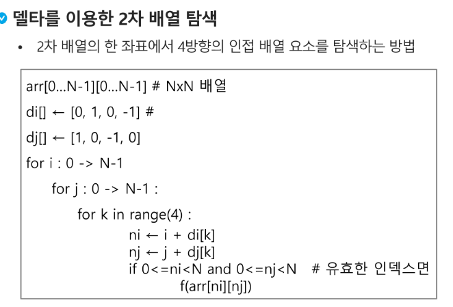

이진 검색을 하기 위해서ㅡㄴ 자료가 정렬된 상태여야 한다.

* 검색 과정
자료의 중앙에 있는 원소를 고른다.

한번 중앙에서 양쪽을 비교 하고 내가 찾고자 하는 값이 중앙 원소보다 작으면 왼쪽을 범위로 검색 아니면 오른쪽
그리고 다음 검색에서도 같은 방식을 쓴다.

이진검색 시간복잡도 logN정도

인덱스는 데이타베이스에 서 유래 했다
테이블 동작 속도를 높여주는 자료구조를 일컫는다.

### 선택정렬

대량의 데이터를 매번 정렬하면 프로그램이 느려지니 배열 인덱스를 사용해서 성능저하를 해결

일단 최솟값을 찾아서 차례대로 선택하여 위치를 교환하는 방식

바꾸는 방법은 A[min_idx]<->A[0]

첫 구간은 0~4 그러면?
이건 할만하다 
~~~
어제 비트 거시기랑 이상하고
근데 버블 정렬은 기억안나니 다시 한번 보기
비트 부분합 하고 또 뭐해야하지
델타!
전치 행렬
델타로 순환하기
~~~

다시 선택정렬
최대 차수가 n2이 되어서 그런것
주어진 구간의 시작이 i
그 다음 누가 제일 작은지 모르니까 맨 앞 원소를  최소로 가정

실제 최솟값 위치 검색
최솟값을 찾았으니 바꾸겠습니당...

### 셀렉션 알고리즘

저장되어 있는 자료로 부터 k번째로 큰 혹은 작은 원소를 찾는 방법

버블정렬과 선택정렬의 차이??
거의 비슷한 느낌인디
버블정렬은
뒤쪽부터 정리하는 방법
선택정렬은 앞부터 정렬하는 방법

