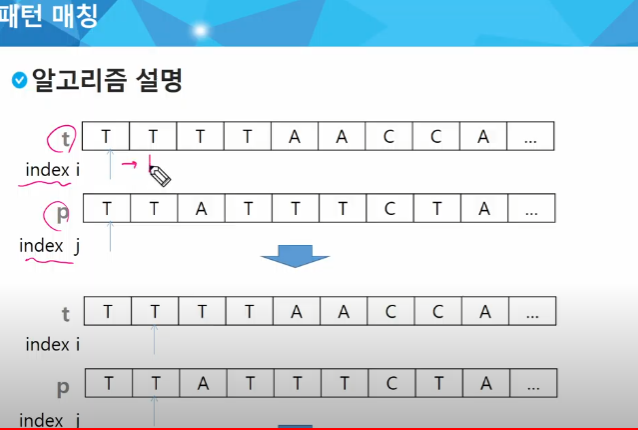
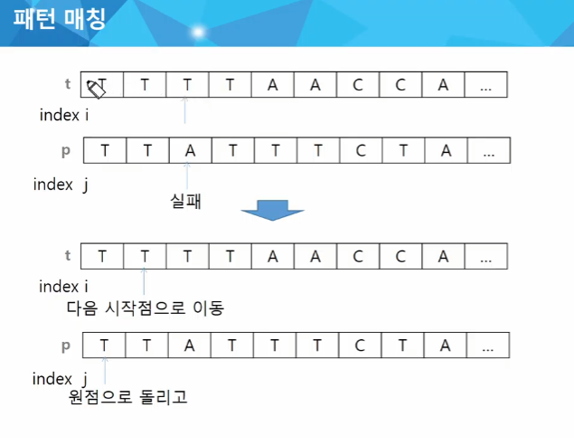
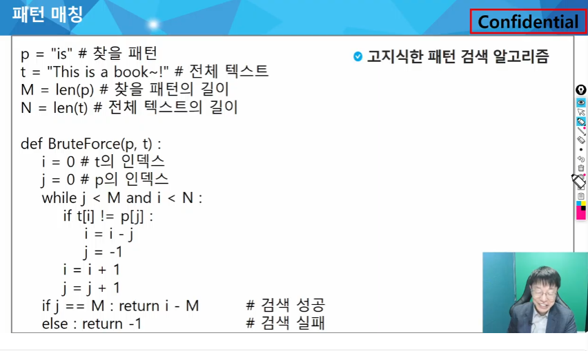
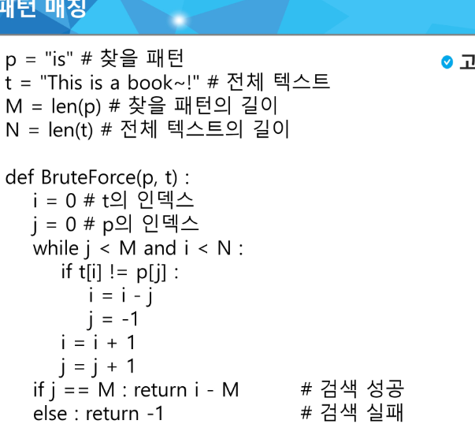
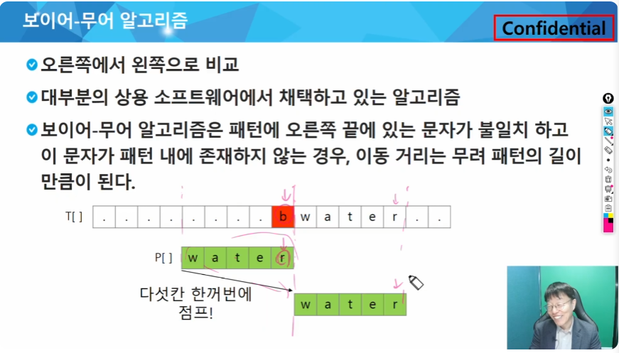
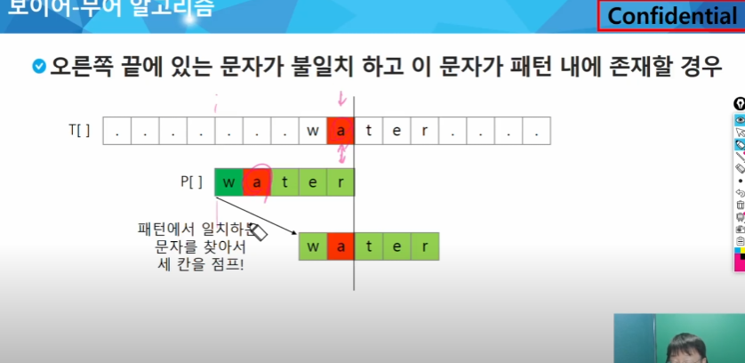

## 패턴 매칭
* 고지식한 패턴 검색 알고리즘
* 카프-라빈 알고리즘
* KMP 알고리즘
* 보이어

### 고지식한 알고리즘(Brute Force)
본문 문자열을 처음부터 끝까지 차례대로 순회하면서 패턴내의 문자들을 일일이 비교하는 방식으로 동작
짧은걸 예로 들면 012이렇게 해서
일일이 비교하는 것
매우 비효율적이긴 하나 반드시 지금 수준에서 구현이 가능해야함

#### 알고리즘 설명

j가 비교를 하는데 패턴의 길이가 텍스트와 같거나 짧을 것
쭈우우욱 가는데 리스트가 벗어나면 밖에 뭐가 있냐고 물으면 에러가 남
인덱스가 패턴과 텍스트의 내부에 있어야함
같으면 무조건 다음
시작점으로 이동을 해서 i고 j가실패라면 방금 내가 시작한 자리로 초기화함
j+1한 점이 원점이 되도록 하면 그냥 1을 더하면 됨
else없이 필요한 if 만 동작하게 만든 코드

검색에 성공한 경우는 찾았어!! 라고하면 전체에서 쟤있어?하는거라 첫번째 나오는 애를 찾으면 됨
i-M을 하면 이 인덱스에 가면 너가 찾는 패턴이 있다.
패턴을 벗어날때 까지 검색에 성공한게 아니면 -1을 리턴(-1은 존재하지 않는 위치니까 실패한걸로 판단)

* 시간 복잡도
    * 최악의 경우 텍스트의 모든 위치에서 패턴을 비교해야 하므로 O(MN)이 된다.
    * 길이가 10000인 문자열에서 길이 80인 패턴을 찾는다고 할 때, 최악의 경우 약
오늘은 인덱스 연산연습...

### KMP 알고리즘
* 패턴을 전처리하여 배열 next[M]을 구해서 잘못된 시작을 최소화
시간복잡도 (M+N)
* 아이디어 설명
텍스트에서 abcdanc까지는 매칭되고 e에서 실패한 상황 패턴의 맨 앞의 abc와 실패 직저의 abc는 동일함을 이용할 수 있따.
일부구간이 중복 반복되는 패턴검색에서는 유리함
일단 비교하는 양이 확 줄어 듬성듬성 건너뚜;먀 ㅔㅎ걇히

매칭이 실패했을때 돌아각기
원래 위치?
반드시 구현하겠땅

### 보이어-무어 알고리즘
* 코드는 짧고 이해하기가 어렵지만 구현을 잘 따라가면 구현가능
* 오른쪽에서 왼쪽으로 비교
* 대부분의 상용 소프트웨어에서 채택하고 있는 알고리즘
* 패턴에 오른쪽 끝에 있는 문자가 불일치하고 이 문자가 패턴 내에 존재하지 않는 경우, 이동 거리는 무려 패턴의 길이 만큼이 된다.

* 텍스트 내에서 비교를하고 맨 뒤를 확인하여 맨뒤가 일치하지 않으면 비교 대상 패턴 길이 만큼 뒤로 간다

오른쪽 끝에 있는 문자가 불일치 하고 이 문자가 패턴에 존재하면 패턴에서 일치하는 문자를 찾아서 세칸을 점프함

* 문자열 매칭 알고리즘 비교
    * 찾고자 하는 문자열 패턴의 길이 m,총문자열 길이 n
    * 고지식한 패턴 검색 알고리즘 : 수행시간 O(mn)
    * 카프-라빈 알고리즘: 수행시간 θ(n) 항상 이만큼 같은 느낌
    * KMP 알고리즘 θ(n)

* 보이어-무어 알고리즘
빅 오메가(n) 아무리 잘해봤자 n 최선의 경우에도 n
보이어 무어 알고리즘은 텍스트 문자를 다 보지 않아도 된다.
오른쪽 부터 비교
    * 최악의 경우 수행시간: θ(mn)
    * 입력에 따라 다르지만 일반적으로 θ(n)보다 시간이 덜 든다

### 시저암호
* 줄리어스 시저가 사용했다고 하는 암호
* 평문에서 일정 문자 수 만큼 평행이동 하여 구현을 한다

### 단일 치환 암호
문자 변환표를 이용하여 암호화함 카이사르 암호화보다 훨씬 강력하다

* 단일치환 암호의 복호화

복호화 하기 위해서는 모든 키의 조합이 필요

* 단일 치환 암호의 키의 총수는
26!
* 1초에 10억개의 키를 적용하는 속도로 해도 120억년의 시간이 걸림

### bit열의 암호화
배타적 논리합exclusive-or 연산 사용

