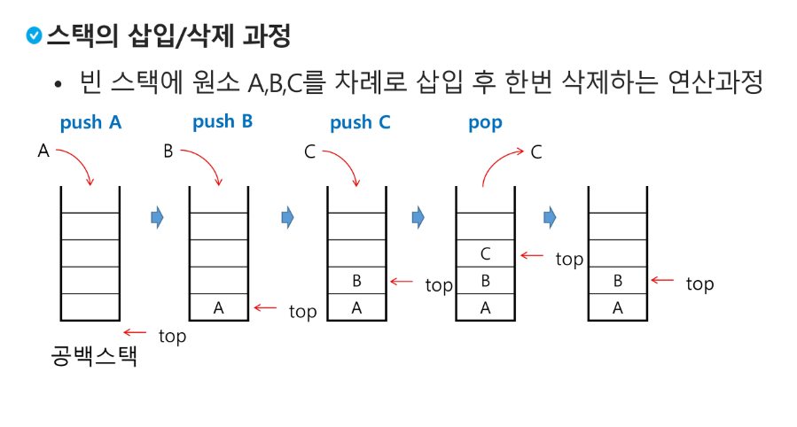
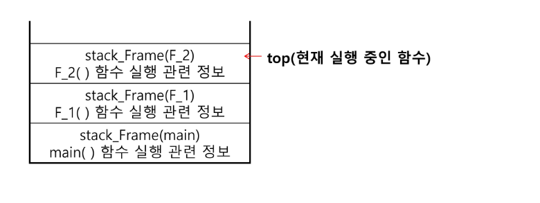

# 스택 1
* 쌓아 올린 형태의 자료구조
* **선형 구조**
    * 선형구조: 자료 간의 관계까 1대1의 관계
    * 비선형구조: 자료 간의 관계가 1대N의 관계 (ex)트리
* 자료를 삽입하거나 꺼낼 수 있음

## 스택(Stack)의 특성
* 마지막에 삽입한 자료를 가장 먼저 꺼냄. 후입선출(LIFO, Last-In-First-Out) 이라함
    * ex) 1,2,3 순으로 자료 삽입하면 3,2,1순으로 꺼낼 수 있음

## 스택을 프로그램에서 구현하기 위해 필요한 자료 구조와 연산
### 자료 구조
자료를 선형으로 저장할 저장소
* 배열을 사용할 수 있음
* 저장소 자체를 스택이라고 부르기도 함
* 스택에서 마지막 삽입된 원소의 위치를 top이라 부름

### 연산
* 삽입: 저장소에 자료를 저장. 보통 **push**라고 부름
* 삭제: 저장소에서 자료를 꺼냄. 삽입 자료의 역순으로 꺼냄. 보통 pop이라고 부름
* 스택이 공백인지 아닌지 확인하는 연산. isEmpty
* 스택의 top에 있는 item(원소)을 반환하는 연산. peek (박스가 있으면 맨 위에 박스가 뭔지 확인해 봐. 같은 의미)


## 스택의 삽입/삭제 과정
* 빈 스택에 원소 A, B, C를 차례로 삽입 후 한번 삭제하는 연산과정


## 스택의 push 알고리즘
* append 메소드를 통해 리스트의 마지막에 데이터를 삽입
```python
def push(item):
    s.append(item)
```
pop: 스택을 확인할 때 쓰면 좋음
구조 파악은 stack으로 풀면 풀리겠는데는 pop으로 간단하게 구현 가능하고 앞에서 했던 크기가 정해진 배열과 top을 이용해서 스택에 넣고 꺼내는 작업도 할 줄 알아야 함.
```python
def push(item, size):
    global top
    top += 1
    if top == size:
        print('overflow!')
    else:
        stack[top] = item
size = 10
stack = [0]*size
top = -1

push(10, size)
top += 1            # push(20)
stack[top] = 20     #
```

## 스택의 pop 알고리즘
```python
def pop():
    if len(s) == 0:
        # underflow
        return
    else:
        return s.pop();
```


```python
def pop():
    global top
    if top == -1:
        print('overflow!')
        return 0
    else:
        top -= 1
        return stack[top+1]

print(pop())

if top > -1:
    top -= 1
    print(stack[top+1])

```
[python 실습 파일](../../4_APS_Practice/240207_practice/test.py)

## 스택 구현 고려 사항
* 장점: 1차원 배열을 사용하여 구현할 경우 구현이 용이
* 단점: 스택의 크기를 변경하기가 어려움
* 나중에 qr?때 보여줄것
* 단점 해결을 위해 저장소를 동적으로 할당하여 스택을 구현. 동적 연결리스트를 이용하여 구현하는 방법을 의미.
* 구현이 복잡하다는 단점이 있지만 메모리를 효율적으로 사용한다는 장점을 가짐. 스택의 동적 구현은 생략

## 괄호의 종류

닫는 괄호인데 스택이 빙있으면 오류

조건:
1. 
2. 
3. 
두가지다 조사해야함 닫는괄호가 나왔는데 스택이 남아있는경우


## 스택의 응용
### Function call

* 프로그램에서의 함수 호출과 복귀에 따른 수행 순서 관리
    * 가장 마지막에 호출된 함수가 가장 먼저 실행을 완료하고 복귀하는 후입선출 구조이므로, 후입선출 구조의 스택을 이용하여 수행순서 관리

    * 함수 호출이 발생하면 호출한 함수 수행에 필요한 지역변수, 매개변수 및 수행 후 복귀할 주소 등의 정보를 스택 프레임(stack frame)에 저장하여 시스탬 스택에 삽입
    
    위에서 부터 실행이 되는데 그렇다고 처리된다고 위에가 삭제되는 것은 아님 2번에서 다시 호추한다면 3번이 다시 불러져 와서 실행된다.
    다른애가 호출 되기 전에는 2번이나 1번에 남아있는 경우가 있는데 이값을 2번이나 1번에서 쓰는건 스택의 구조를 이해하지 못한 것!
    호출 복귀시간이 추가된 것임

## 재귀호출
호출할때 메모리가 서로 구분됨??
무슨 소리냐...
이해가 안된다

서로 다른 함수를 호출하는 것 마냥 구분??
오늘강의는 다시 듣는게 좋을듯...
ㅠㅠ

한번 구했던건 다시 계산하지 말고 기억해놓고 쓰자!
theta 2n 그냥 다하면 시간 복잡도 저정도

메모이제이션: 매번 다시 계싼하지 않게 메모리에 저장해서 전체적인 실행속도를 빠르게 하는 기술, 동적 계획법의 핵심이 되는 기술
따로 계산할 거 없이 0하고 1은 앞에 미리 넣어두자!
간단하자나!
개졸리다.
