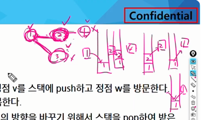
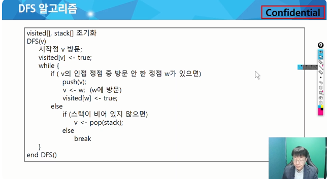

스택을 2개로 나누자고 했는데 배열의 인덱스로 생각하는 것
스택나왔으니 줄줄줄 메모이제이션 까지..
시스템 함수 이야기 했다가 그럼 재귀 함수는? 서로다른 함수를 호출하는 것과 같다
그 와중에 재귀 호출은 중복이 많은데 
# 다이나믹 프로그래밍 DP
* 동적계획 ㅏㄹ고리즘은 그리디 알고리즘과 같이 최적화 문제를 해결하는 알고리즘이다.
* 동적계획 알고리즘은 입력 크기가 작은 문제들을 모두 해결하고 그 해들을 이용해 보다 ㅌ튼 문제를 해결하는 전체 ㅈ문제를 해결하는 알고리즘

A형 취득후 좀더 높은 곳을 보고 싶다면 추가로 더 공부해야 할 부분이다
우리는 지금 그건 아니고 이런게 있구나 이런식의 접근방법이구나 이렇게 보면된다.
## 피보나치 수 DP 적용
* 피보나치 수는 부분 문제의 답으로 부터 본문제의 답을 얻을 수 있으므로 최적 부분 구조로 이루어져 있다.

재귀로 하지 않고 큰 부분에서 작은 부분으로 가보자
하나 전과 두개전의 값을 해서 여기 저장
3을 구하려면?
하나 전의 것
두개 전의 것에 가서 값을 가져다가 더해서 여기다 이케 집어넣으면 2가 됨

DP구현방식
리크르시브 방식:fib1()
이터러티브 방식: fib2()

메모이 제이션을 재귀적 구조에 사용하느 것보다 반복적 구조로 DP를 구현한 것이 성능 면에서 보다 효율적
재귀적 구조는 내부에 시스템 호출 스택을 사용하는 오버헤드가 발생하기 때문

DFS(깊이 우선 탐색)
비선형구조인 그래프 구조는 그래프로 표현된 모든 자료를 빠짐없이 검색하는 것이 중요함
두가지 방법
깊이 우선 탐색
너비운선 탐색
스택이 탐색에서도 사용하는데 이걸 어케쓰지?
그래프에서 본격적으로 등장하긴 하는데 많은 경우에 스택 부분에서 스택 활용예로 보여준다,

스택은 DFS 에서도 사용할수있다고 할수있지만 DFS가 뭐냐면 스택을 활용한거다라고 말하면 안됨

다른 방식으로 구현이 가능하기 때문
DFS
지나온 경로를 저장저장저장 이러다가 가장 마지막에 저장한 곳을 꺼내는 것
?

저장한 것을 역순으로 빼내는 방법

가장 마지막 갈림길부터 꺼내는 것

시작 점을 정해주는데 이건 모든 지점을 탐색할 수있땅

노드라고 하는 어떤 상태일수도 있구 현재 안정 상태였다가 
정점을 거쳐서 저리로 감
1번을 거쳐서 2번으로 가고 2번을 스택에 넣고 2번으로 방문을 함

반복문이니까 안에서 만들어도 된다는데 이핵 안가는디:?
ㄴㅇㄱ~
시작점을 방무ㄴ하고
0,1,2,3,4 이렇게 하고 0으로 채워넣는다
1번으로 갔다가 1번을 체크해두면 된다.
"??
이거 뭔소리랭 이해가 안가는디
어렵누...
정리해야겠누...

DFS인데 매우 비슷하게 생긴 DFS코드가 ㅇㅆ다
우선은 앞 설명에 맞게 거의 그대로 옮겨놓은 방식
잊ㄴ접 정점중 방문 안한 곳이 있으면 1번에서 보니까 2번 3번이 인접인데 둘다 방문안했어
그래서 보통 빠른 번호순으로 찾음
얘를 저장함
1번을 저장해두고
여기를 방문할랭
방문하면 1로 표시
?????????
그림으로 이해하기
각단계별로 스택에 뭐가 저장됐다ㅏ 그ㅐ는지 이해
ㄴㄴㄴㄴㄴㄴㄴㄴㄴㄴㄴㄴㄴㄴㄴㄴㄴㄴㄴㄴㄴㄴㄴㄴㄴㄴㄴㄴㄴㄴㄴㄴㄴㄴㄴㄴㄴㄴㄴㄴㄴㄴㄴㄴㄴㄴㄴㄴㄴㄴ

노드의 크기만큼 만들기?

오름차순으로 가서B와 C 가 거리가 같지만 B로 간다
D에 인접하고 방문아한공을 찾으면 F를 본까 방문 안햇ㅇㅁ
다음선가인접한곳중에 방문 안한곳을 찾아가는 변태임

팝해서 이전위치로 가봐

앞으로 가는건 탐색 아까 출발했던 갈림기릉ㄹㄴ 어ㅣㅣㅣㅣㅣㅣㅣㅣㅣㅣㅣㅣㅣㅣ
나 어디서 왔지 하다가 더이상 없으면 끝! 이렇게 됨
1  번부터 7번까지 다 돌았음
