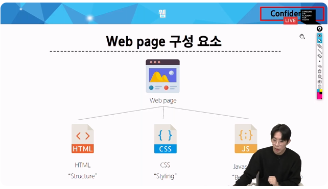
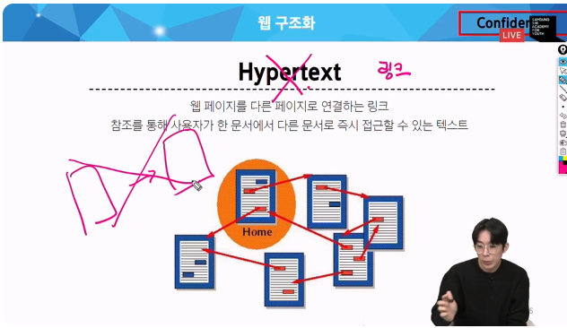
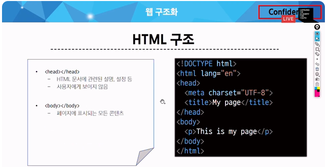
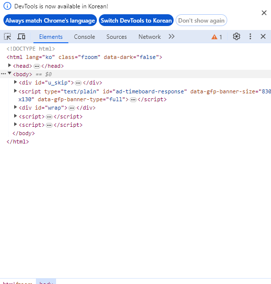
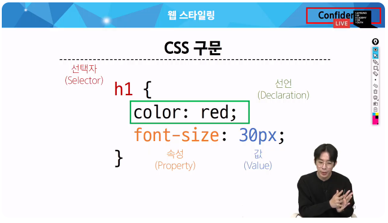

# 웹과정
##
깃랩에 수업 코드를 올려주는데
파이썬 공통이라는 그룹에 web이라는 레포지토리가있음
풀 받은 위치에 그거 클론 받아주기
오늘 01번 파일이있음

web 사전준비사항 vs코드에 다운바당두면 좋음
웹은 다시 vs코드 씀
여기까지 해서 2가지 정도 미리 준비해두기
# 웹
World wide web=>www
인터넷으로 연결된 컴퓨터 들이 정보를 공유하는 거대한 정보 공간
web : 좀 더 큰 범주에서 website web application 등 정보 포함 사용자들 정보 검색 서로 상호작용하ㅡㄴ기술을 웹이라고함

보통 웹서핑ㅇ 한다고 함
웹에서 활동하는 걸

웹사이트: 어떤 사이트에 들어가면 어디어디 사이트에 들어가자 ㅓㅇ디 어디 사이트에 들어가면 그게 실제로 ㅜ엡사이트를 의미하는데 이거는 여러개의 웹 페이지가 모인것
궁극적으로 사용자에게 어떤 정보나 서비스를 제공하는것

웹페이지ㅣ HTML CS 같은 웹기술을 이용해 만들어지 ㄴ웹사이트를 구성하는 하ㅏ의 요소

하나의 페이지가 아님 블로그 페이지 스포츠페이지 ㅇ... 이런게 모여서 하나의 사이트가 된다
페이지만드ㅡㄴ 기술은 HTML CSS가 필요한데 보통 자바스크립트나 이런게 필요하지만 오늘은 이거 두개
하나의 웹페이지 구성하기 위해서는
이 구성요소를 집에 비유함녀
## 집구성--> 웹페이지
1. 철골: 구조--> HTML
2. 페인트: 스타일링->CSS
3. 전자기 전기배선: 행동->자바스ㅡㅋ립트
구조 스탕일링 행위
이렇게 3가지로 나뉘는데 이 하우스를 웹페이지로 바꾼다면?

크게 저 세가지가 혀법해서 하나의 웹페이지를 구성한다
이 4일간 열심히 배ㅜ는건 html css 고 js 는 후반기에 배움

## 웹 구조화
HTML
HyperText Markup Language
마크업을 하는 언어?
마크업은? 마크다운은 마크업에서 따왔다는 말이있음
실제로 이 마크업이라는 건 어떠한 구조를 정의한다 라고함
어떠한 구조를 마크업한다
웹페이지의 의미와 구조를 정의한다
하지만 프로그래밍언어는 아님
크게 2가지를 정의한다

구조 뿐만 아니라 의미도 담고 있음
구조+의미를 담고 있음
### Hypetext는 우리가 아는 링크임

웹페이지에서 다른페이지 이동에서 링크를 클릭함
이걸 하이퍼링크라고함 
웹페이지에서 다른페이지로 이동할때 연결하는 링크를 하이퍼 텍스트라고함

웹페이지 간에 참조를 통해 한문서에서 다른문서로 즉시 이동할 수 있는 텍스트

장점:
이전에는 페이지가 반드시 이전과 다음만 있었음
하이퍼텍스트가 생기며 이런 구조가 깨짐

Markup Language
태그등을 통해서 문서나 데이터의 구조를 명시하는 언어 ex) HTML, Mardown

예시
좀더 정보를 인식하기 편하게 정리하는것
구조화한다
이런걸 바로 마크업 한다라고 함
우리가 사용하는 html 문법 적용하면 <h1>이런게 들어감 
요런 문서의 구조화

HTML 구조
<!DOCTYPE html>
더큐먼트 타입이기 때문
해당 문서 웹페이지 문서를 만드는데 해석을해서 우리에게 보여주는 주체가 브라우저임
우리가 쓰는 브라우저임

하지만 실제 사용자는 저런 이상한 화면이 아닌 해서고딘 화면ㅇ늘 보는데 이걸 보통 크롬이 해석해줌
이렇게 된걸 브라우저가 해석해주다

이게 근데 해석전에 어떤 문서에 적어줘야하는데 그게 바로이거
그뒤로 예제 코드가 작성이 된다
크게 잘 보면 요런 범위로 되어있는데
html 태그가 있는ㄴ데 아래에 html 태그가 있음
/업는게 여는태그 있ㄴ는게 닫는 태그
그 안에 head body가 있음
하나의 큰 html 안에 두개의 태그가 있음
문서는 머리와 몸통으로 크게 나뉨
html은 전체 페이지의 콘텐츠를 포함하는 푀상단 태그

타이틀은 브라우저 쓸때 탭 보면 탭의 이름이 존재하는데 그게 타이틀 태그 네이버 싸피 이런거

해드와 바ㅣ디는 
html 문서관련 설정 과련한것
설명
사용자에게 보여지 않음

헤드 말하는것

설정이 들어가니까 웹서핑에 보이는게 아니고
우리가 눈으로 보는 것 과 관련한 화면은 다 바디에서 작성이 된다

실제 웹 페이지에서 확인하기~

컨트롤+시프트+i를 누르면 개발자도구를 켤 수 있음

네이버는 이렇게 생김

코드위에 마우스 커서 올리면 보이는 영역이 표시되는데 헤드는 체크 없고 바디는 전체 다 체크ㄱ되는ㄴ게 보임

하나하나 요소 보기
### HTMl 엘리먼트 (요소)
HTML은 튿히 두가지 요소로 되어있음
엳는 태그와 닫는 태그로 구성되어있고 그 안에 들어가는 내용ㅇ를 컨텐츠ㅏ고 하고
이 태그 컨탠츠 를 통합해서 요소라고 함
닫는 태그 앞 슬래시를 하는데 닫는 태그가 없는 슬래시도 존재함
100프로 다 존재하는건 아님

HTML Attributes 엘리먼트에 들어가는 속성

이 속성은 여는ㄴ 태그쪽에 작성이 됨
규칙은 요소 이름과 속성 사이에 공백이 있어야함

하나이상의 속성이 들어갈 수 있음
도다른 속성이 존재하면 역시 공백을 ㅗ 구분됨
큰따옴표로 쓰거라

목적:
나타내고 싶지 않지만 추가적인 기능 내용을 담고 싶을때
CSS 해당 요소로를 선택하기 위해 왜냐면  css 스타일 입히려면 선택해야하는데 그 선택을 하기 위한 값을 ㅗ활용을 많이함
이 속성값에 다양한 목적이 있는데 이 속성값의 다양한 목적도 이따 작성하면서 하나하나 보게될것

처음으로 작성해볼것

 html 확장자는 .html

 태그 에 꺽쇄 쓸필요없이 태그이름 바로 치고 엔터 치면 알아서 해줌

 ## HTML Text Structure
 HTML 의 ㅈ요 목정ㅇㄱ은 텍스트 구조와 의미 전달

 HTML 이게 ㅏㄴ수히 웹의 구조 뿐만 ㅏ니라 하나하나 구조의 의미가 가지고있다

 대표적으로 h1이라는 테그가 있는데 
 이 문서의 대 주제를 표현하기 위한 태그
 h1 태그ㅡㄴ 이런 크기 이런 사이즈로 입력해야한다는게 브라우저에 기보적으로 입력되어있음
 이게 마크다운 # 한개와 같은느낌
 실제로 h2 태그가 있음
 이건 h1 보다 작음
 그래서 이게 익 구 조를 마크다운이 그대로 가져간거라 샵의 갯수가 늘어가면 크기가 작아짐

 하지만 단순히 크게만 만드는게 아니고 이 문서닁 최상위 제목이라는 의미또한 ㅜㅂ여한다
 p 태그도 스타일 입혀서 크기 키울수 있는데그런데 그거는 단순히 텍스트를 크게만 만든거지 이게 이 문서의 대주제 대제목 이다라는 의미를 부여한 것은 아님 그래서 일반적으로 스타일을 통해서 크게 키운거랑은 다르다 궈장사항은 하나의 html 문서에 하나만 작성한다

권장

대표적인건
h1~6, p
리스트 ㅗ가련 태그
기울임 강조  이런것들을 대표적으로 쓸 수 있음

 이거 매번 html 쓰고 헤드쓰고 닥스트립 쓰기 귀찮 ! 하고 엔터 누르면 짠하고 끝남
 그럼 바로 바디로 들어가서 작성하기 느낌표하고 엔터누르면 완성이 됨

 바로 바디로 이동해서 작성하면 됨
ol 은 오더드 리스트 ul은 언오더드 리스트로 li 가 아래에 들어감 strong은 굵은 표시

들여쓰기 같은거 하는데 이걸 없이 한다면?
새로 고침을 해도 변화가 없음
이걸 열심 들여쓰기 엔터 친게 사실 html 해석에 영향을 주지 않음

그럼 왜 굳이...?
이건 누구를 위해서?
사람을 위해서
하지만 사람이 개발을 해야 하기 때문에 어떤 부모 태그 아래에 어떤 자식 태그가 있는지 봐야해서 규칙에 있는 이 일련의 규칙에 의해서 엔터를 치고 하는 과정이 있음
만약에 여깃 ㅓ p태그 안에서 엔터를 쳐보면?
엔터를 치고 새로고침하면 엔터를 친게 아니라 공백을 넣은것 처럼 됨
태그안에서 엔터를 치는 행위를 html은 엔터로 인식하지 않고 태그 안 엔터 불가능

엔터 담당 태그 따로 있음 br 브레이크 라인이라는 태그를 넣어주면 그제서야 엔터가 된다
이걸로 html은 끝이고 이걸 어케 꾸미는지가 더 많은 걸 들어가있음
html 쁜만아니라 아프로 웹 학습때 mdn이라는 문서를 꼭 확인해야함
모질라 제단 파이폭스 모질라 제단 디벨롭 먼트 네트워크인데 웹에 관련된 웹표준 문서를 아주잘 전ㅇ맇나 ㅏㅅ이트 크게 웹기술에 대한 전바적인 기술들을 모두다 표현하고 있음 가이드 검색시
html h1 tag mdn 이렇게 mdn을 꼭 끼워서 검색하기 
웹은 mdn을 0순위로 봐주기 웹표준을 정의해둔게 mdn 가장 개념에 대한 신뢰성 높은 정화학 문ㄴ ㅓㅅ를 제공해주기 때문
mdn은 ㅏㅈ습서도 있어서 추가 핛ㅂ을 하려면 그걸 봐도 좋음

## 웹 스타일링
### css
구조에 살을 입혀주는 스타일 입혀주는 css

Cascading Style Sheet
아래로 떨어지는 폭포가 아래로 떨어지는
아래로 흐른다
그런 의미를 가지고 있음 
에ㅜㅂ페이지 디자인 뿐만아니라 레잉아웃 배치
다 아래로만 작성한 html은
예쁘게 해주는거 css가 함

선택자는 필수로 알아두셈 왜냐면  js 에서도 쓰기때문 

명시도도 css하기위해서 잘 기억해줘야함
명시도 정답률 구림

