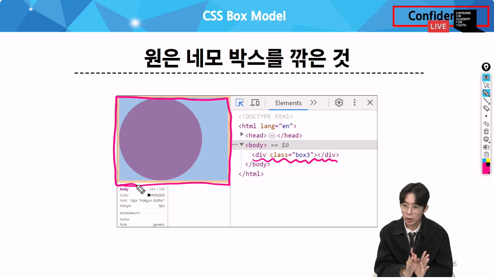
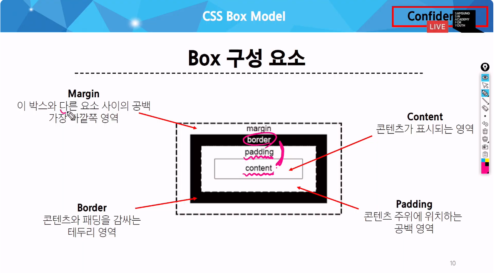
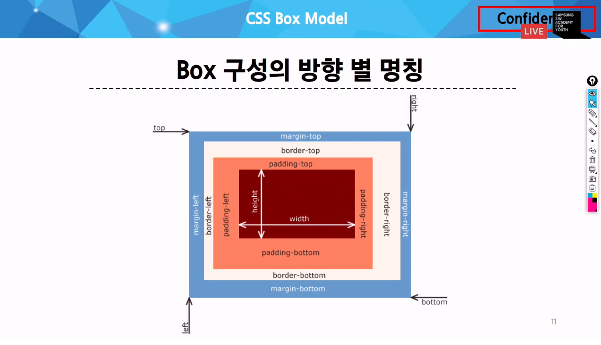
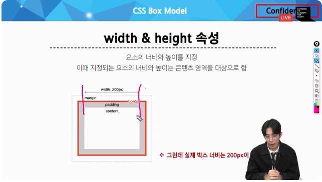
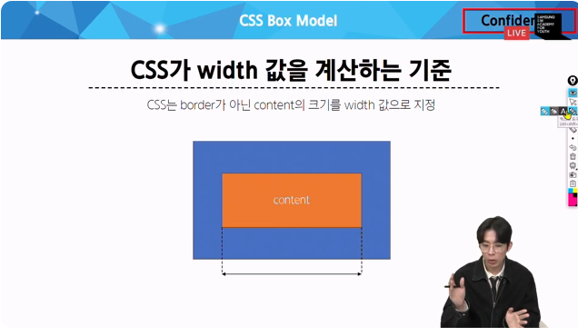
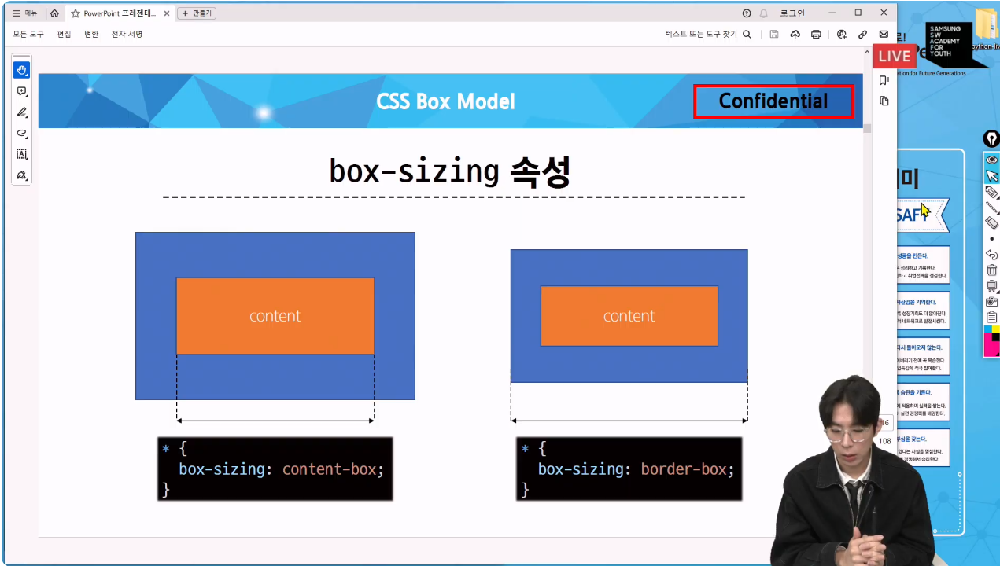
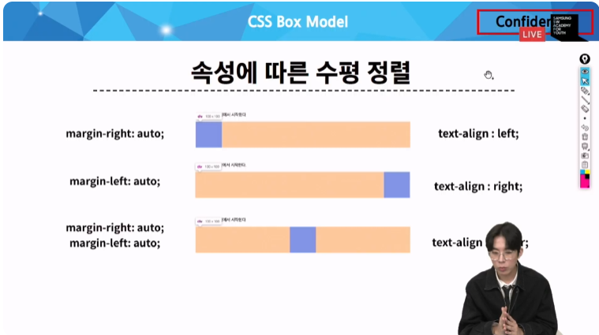

# CSS
오늘은 CSS를 본격적으로 다룬다
html은 골격
css 스타일
레이아웃 요소들의 배치
지난 시간은 사이즈나 색깔 배치는 하지 않음

어떻게??
이동 배치??
배치를 위한 기술??
크게 2가지
포지션, 플렉스 박스
먼저 어떻게 html구조를 ㅁ보나 이를 박스 모델이라함
## CSS Box Model
css는 모든 html요소를 옝외없이 사각형 박스로 바라본다

원만큼의 영역을 차지하겠다고 생각할수있지만 스타일로 div를 깎으면 저만큼의 영역 네모난 박스 만큼의 영역을 차지하고 있음
이것을 박스모델이라함
실제 네이버도 깎여이쓴데ㅗ 실제로는 네모로된 박스
실제 html을 네모네모 박스라고 생각하고 바라보아야함
### 구성요소
박스는 크게 내용 안쪽 여백 테두리 외부간격
패딩 : 테두리와 안에 내용간의 여백
마지기: 테두리 부터 외부간격

박스 바깥 다른 요소사이의 공백 이를 마진이라함
이친구들 특징
각각 방향이 있음
각 4개

위아래 좌우
총 4방향
안쪽 컨텐트는 너비와 높이로 조절
총 4가지방향 존재

윋스 너비 지정할때 지정되는 요ㅗ의 너비와 높이는 콘텐츠 영역을 대상으로 한다

박스사이징이라ㅡㄴ 설정을 보더박스로 바꿔주어야한다

# 박스타입
블락박스& 인라인박스
블락은 무언가 블락 막는다는 의미
인라인은 인라인스타일같이 어디어디 안쪽 사이에
막는박스 어디사이에 ㅡㄹ어가는 박스
두가지 박스에 배치 흐름
css 적용안할대 html 모든 요소는 좌측 상단에서 시작
그런데 여기서 부터는 2가지 박스가 바얗ㅇ이 달라짐
인라인 박스를 여러개를 만들면 좌측에서 우측으로 흐름 아래가 아니라 올느족
그런데 블락은 아래로 감
우리에게 익숙한건 아래로 가는 블락방향
p 패읻ㅇ태그 입력하느네로 아래로 떨어짐 전부 블락타입이라고 보면된다\
normal flow

2-3에서 파란색 블락 빨간색은 인라인 친구들
각 영역을 보면
h1 대표적 블락요소
텍스트 영역은 좁지만 오른쪽 끝자리 빈자리까지 욕짐쟁이처럼 다머긍ㅁ
이게 블락 요소들의 특징
다 자기꺼
그ㅐㄹ서 계속 아래로 가게된다
방향이 정해지게 아니라 오른쪽을 다 차지해서 어쩔수 없이 아래로 흐르는 것
블락은 본인 영역 + 오른쪽 빈 영역 전부!!!
빨간색 처리된 인라인 친구들은 a태그 스팬태그 이미지 태그
보면 딱 자기 컨텐츠 영역만큼만 차지함
이미지도 마찬가지
만약 블락이라면 이미지 다음에나오는 텍스트가 아래로 가야함
브라락 요소가 아니라 오른쪽 영역이 없어서 오른쪽으로 나머지 요소가 출력되는것을 확인가능
이걸 잘 앙ㄹ아야 나중에 따로따로 혼합해서 생각하고 배치해야함

각자 타입 디테일 특징
## 블락타입
* 너비를 보닌이 사용한 공간에 100프로 사용해서 항상 새로운 행 다음요소가 아래로 나타냄
* 블락은 너비와 높이 지정을 가능해서 기본 윗스 지정하지 않으면 박스는 오른쪽 끝까지 다 차지한다.
* 대표적 태그는 h1~6, p, div 대부분 블락이긴함
 
## 인라인
* 본인 컨텐츠 영역만큼만 너비를 차지해서 오른쪽을 꽉채우지 않는이상 오른쪽 영역이 비게 되고 새로운 행ㅇ로 나뉘지 않고 인라인 타입은 너비와 높이를 지정할 수 없다
* 인라인은 너비를 5만큼만? 본인이 가진 컨텐츠 만큼만 차지 그래서 강제로 늘릴수없음
윗스와 하이트 속성 쓸 수 없지만되는게 있음
* 수직방향
    * 패딩값주고 마진값주고 할 수 있지만 다른 요소를 밀어낼 수 없음
    * 원래 마진을 주면 마진 넓이만큼 상대를 밀어내지만 인라인은 밀어내지는 못하고 줄 수 있음 그래서 인라인으로 마진 위아래주는건 이ㅡ미 없음
* 수평방향
    * 그런데 수평방향은 가능함 인라인 흐름 자체가 수평방향으로 흐르기 때문에 수평방향으로는 패딩 마닞ㄴ줬을때 밀어낼 수 ㅣㅇㅆ음
* 대표적인 태그 a,img,span

수평은 밀 수 있지만 위아래는 본인 흐름 방향이 아니라 밀어낼 수 없음
이미지는 너비와 높이를 지정할 수 있었는데 이미지만 예외임
ㅇㄴ라인 요소지만 사이즈조정이 가능함

## 속성에 따른 수평 정렬
### 블락 요소
작은 넓이만 차지하고 있얻 block이라는 div 박스를 옮기려면 오른쪽에 남는 마진영역을 컨트롤 해야함
오른쪽 끝까지 다 차지하기 대문

배치시 초점을 대상이 아니라 영역에 둬야한다
관점을 얘의 영역을 어케 할 지 생각해야함
마진 오른쫑족에 ㅇㅆ는걸 좌우로 자동으로 나눠줘야 얘가 가운데로 가는 것 관점을 바꿀 필요가 있음
이게 쉽지 않음
정렬의 주체에 보통 맞추는데 이렇게 하며ㅓ css가 어려움
영역을 어떻게 다룰지 이게 어려움
오른쪽 정렬하고 하고싶음 오른쪽 끝으로 쟤가 오른쪽으로 가려면 어케해야함?
오른쪽 마진 꽉찬걸 왼쪽으로 다ㅓㅁ기면 됨 그ㅐㄹ서 marginleft auto가 오른족 정렬이 되는것
오홍
옮기려는 요소가 아닌 걔를 둘러싼 영역을 어케 컨트롤?
그래서 이 블락 친구들은 항 상 마진이 꽉차있어서 항상 마진을 통해서 수평정렬을 함
인라인은 텍스트 얼라인의라는 속성을 통해서 정렬을 한다

똑같은 박스모델이어도 인라인이냐 블락박스냥 따라 정렬이 다르게 감
영역을 항사 ㅇ조정을하는거다

디스플렝를 블락과 인라인을 봤음
## 기타 display 속성
* inline-block
인라인 특징과 블락 특징을 혼합해서 가진 친구
기본적으로ㅡㄴ 인라인의 특성을 가지지만 근데 인라인의 단점인 너비와 높이 요소를 위아래로 밀어낼 수 없다는 단점 그걸 누가하지? 블라이 가능
블락이 가진 그 특징 일부분을 가져온 바긋로 기본적으로 흐름은 인라인인데 박스의 
* none