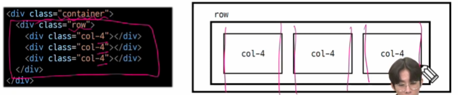
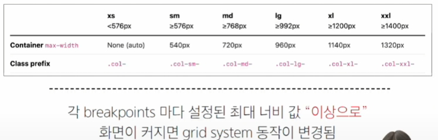

# web 단축키
1. ctrl+l:한 줄 선택
2. ctrl+d: 동일한 키워드 연속 선택선택하고 싶은 속성을 더블 클릭하고 ctrl+d를 누르면 아래로 선택이 된다.
3. ctrl+alt+화살표: 멀티 커서
4. alt+클릭: 멀티 커서
5. alt+화살표: 선택한 라인 끌고가기
6. alt+shift+화살표: 선택한 라인 복사
(치트시트)[!https://docs.emmet.io/cheat-sheet/]

# 반응형 웹
## Bootstrap Grid system
웹페이지 레이아웃을 조정하는데 사용되는 **12개의 컬럼**으로 구성된 시스템
단순히 나누는게 아닌 레이아웃 조정을 12개컬럼으로 맞춰 지정하겠다는것
* 왜 12개??
  하나의 웹 페이지를 다양한 기기에 적절하게 맞춰서 표현하고 싶은 것
  약수가 많기 때문
  안에들어가서 작은 데도 같은 레이아웃이 적용됨

## Grid system 목적

반응형 디자인을 지원해 웹 페이지를 모바일, 태블릿,
## 반응형 웹 디자인 (Responsive Web Design)
디바이스 종류나 화면 크기에 상관없이, 어디서든 일관된 레이아웃 및 사용자 경험을 제공하는 디자인 기술

## 그리드 시스템 기본 요소
1. Container
  * Column들을 담고있는 공간
2. Column
  * 실제 컨텐츠를 포함하는 부분
3. Gutter
  * 컬럼과 컬럼 사이의 여백 영역

1개의 row 안에 12개의 column 영역이 구성
--> 각 요소는 12개 중 몇 개를 차지할 것인지 지정

12개를 4개씩 줬으니 3등분 이라는 의미

상쇄시키고 등장하기 offset
gutters
grid system에서 column 사이에 여백 영역 x 축은 padding, y축은 margin으로 여백 생성
거터값은 행 row한테 줌
너네 여백 가지지 마
좌우 여백 gx-0이라면 붙여짐

grid system은
css 가 아니 편집 디자인에서 나온 개념
구성 요소를 잘 배치해서 좋은 결과물을 만들기 위함
격자
부트 스트랩이 css 기술로 차용해서 쓰는 것
정보의 구조와 배열을 일관성있게 체계적으로 작성해서 전체ㅡㄹ 봤을때 안정적인 구성을 한다

부트 스트램 그리드 시스템에서는 12개 컬럼과 6개 브레이크 포인트가 있는데 이를 사용하여 반응형 웹 디자인을 구현

Grid system breakpoints
웹 페이지를 다양한 화면 크기에서 적절하게 배치하기 위한 분기점 ->화면 너비에 따라 6개의 분기저 제공( xs,sm,md,lg,xl,xxl)
공식문서를 보면 사이즈가 지정되어있음

화면 너비가 576픽셀 미만이면 xs
sm 사이즈를 끌고감
이상이니까
576이상이니까
라지부터는 재조정

6ㅏ지르 필수 작성할 필요는 없고 6가지 대해 모두 제공해준다 알아주기~
xs으 키워드가 없다는 거 주의해보기

!(https://getbootstrap.com/docs/5.3/layout/grid/)

오프셋은 상쇄

브레이크 포인트와 함께 사용할 경우 오프셋이 해제가 되지않고 사용될 수 있음
그래서 그것보다 큰 사이즈에 관해서 오프셋을 재 정의해줘야한다

미디어 쿼리
아까 브레이크 포인트 표에서 봤던 ~~ 이상 이런거
왜이렇게 정한건가영
아마...부트스트랩 팀에서...

각 기술은 용도와 장단점이 있음
 각 기술은 독립적 용도가 아니고 적절하게 활용이 되어야함
 특정상황 어떤 기술 쓰일지는 다 다름

 https://web.dev/?hl=ko