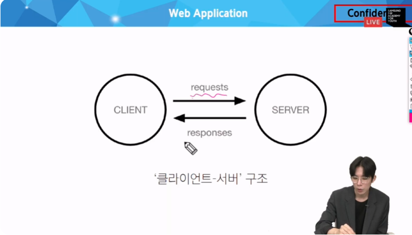
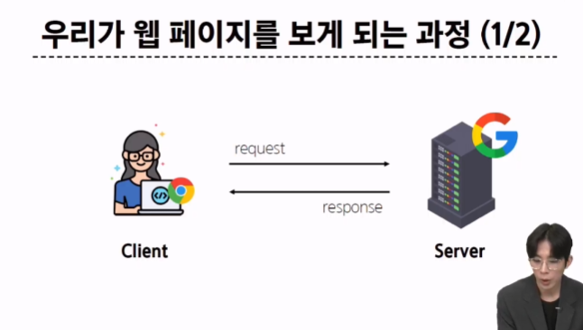
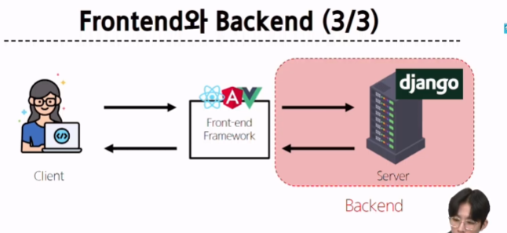
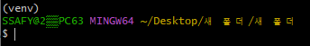
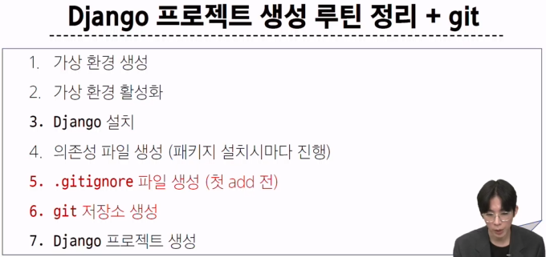
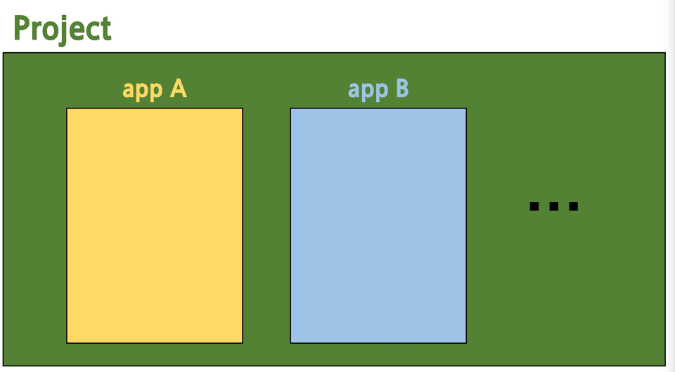

# Web application (web service) 개발
* 인터넷을 통해 사용자에게 제공되는 소프트 웨어 프로그램을 구축하는 과정
* 다양한 디바이스 (모바일, 태블릿, PC 등)에서 웹 브라우저를 통해 접근하고 사용할 수 있음

## 클라이언트와 서버
### 웹의 동작 방식
우리가 컴퓨터 혹은 모바일 기기로 **웹 페이지를 보게 될 때 까지 무슨 일이 일어날까?**

#### Client 클라이언트
서비스를 요청하는 주체 ( 웹 사용자의 인터넷이 연결된 장치, 웹 브라우저)

#### Server 서버
클라이언트의 요청에 응답하는 주체 (웹 페이지, 앱을 저장하는 컴퓨터)

* 우리가 웹 페이지를 보게 되는 과정

  1. 웹 브라우저(클라이언트)에서 'google.com'(주소)을 입력
  2. 브라우저는 인터넷에 연결된 전세계 어딘 가에 있는 구글 컴퓨터 (서버)에게 'Google 홈페이지.html' 파일을 달라고 **요청**
  3. 요청을 받은 구글 컴퓨터는 데이터베이스에서 'Google 홈페이지.html' 파일을 찾아 **응답**
  4. 전달받은 'Google 홈페이지.html' 파일을 사람이 볼 수 있또록 웹 브라우저가 해석해주면서 사용자는 구글의 메인 페이지를 보게 됨

  웹의 속도가 너무 빨라 엔터를 치면 바로 메인 페이지가 보이지만 그 중간에 이런 과정이 일어남
  요청, 응답

프론트엔드 & 백엔드
프론트엔드
사용자가 직접 보는 부분을 담당, 사용자 인터펲이스를 구성하고 애플리케이션과 상호작용르 하게함
html,css,javascript,프론트엔드 프레임 워크 등

백엔드
서버측에서 동작하며, 클라이언트의 요청에 대한 처리와 데이터 베이스와의 상호작용 등을 담당
서버언어(python, java 등) 및 백엔드 프레임워크, 데이터베이스, api, 보안 등

사용자의 요청에 의해 열심히 뒤에서 안보이지만 구동되고 있는 것들

장고라는 것을 이용해 서버를 만들 것
요거 없이 화살표가 다시 이어진다고 보면 된다

프레임워크
웹 프레임워크
웹 서비스 개발에는 뭐가 필요하징?
* 로그인, 로그아웃, 회원관리, 데이터베이스, 보안 등... 너무 많은 기술들이 필요
* 현대 개발 트렌드는 이미 전세계 어딘가에 잘 만들어진 것을 가져와 좋은 환경에서 내가 만들고자 하는 것으로 결과 내는것
  **거인의 어깨 위에서 프로그래밍하기**
  그런게 프레임 워크

웹프레임워크
웹 어플리케이션을 빠르게 개발할 수 있도록 도와주는 도구
(개발에 필요한 기본 구조, 규칙, 라이브러리 등을 제공)

쟝고라는 프레임워크
파이썬 기반의 대표적인 웹 프레임워크

왜 쟝고?
* 다양성
* 확장성
* 보안
* 커뮤니티 지원

가상 환경
파이썬 애플리케이션과 그에 따른 패키지들을 격리하여 관리할 수 있는 독립적인 실행 환경

여태는 글로벌 환경에 님파이같은 걸 pip install을 ㅗㅇ해 받음
하지만 앞으로 이렇게 받음 안된다
어떠한 가상의 환경을 만들어 격리해야함
환경을 여러개 만들어 격리해야함
1번 환경을 하면 2번에는 영향을 주지 않는 독립적 환경

프로젝트 a,b개발 영역이 따로 필요함
독립 적인 개발 환경이 필요 
프로젝트 버젼이 다르면 계속 다시 설치해야함

둘이 다른 패키지를 쓰는데 다른 패키지를 같이 쓸 경우 충돌이 발생할 수 있음
이럴때도 독립적인 환경 필요

1. 가상환경 venv 생성
 `python -m venv venv`
나 이제 가상 환경 만들거야 가 첫 venv 까지고
두번 째 venv는 가상환경의 이름

본인 파이썬 버전을 사용하는 퓨어한 환경이 생성됨
여기까지가 1번
두번째 가상환경을 사용하고 싶다면 온오프를 해야함
??
폴더가 생긴다고 해서 그 폴더로 들어가는 게 아니라 저 스위치를 위로 올리고 아래로 내리고 하는 그런 개념
저 폴더가 어디에 위치해있던 간에 우리가 온오프 하는 위치는 상관이 없다는 것
내가 개발을 하고자 하는 위치에 두는게 가장 일반적
다른데 둬도 되지만 켤때 경로가 복잡해지니 그냥 내가 진행하는 그 프로젝트 안에 둠
`source venv/Scripts/activate`
들어갈 수 있지만 절대 터치하면 안된다...
걍 냅둬유
나 지금 저 가상환경 온 한다~~

(venv)
이걸로 가상환경인걸 알려줌
`pip list`
를 치면 어떤 패키지가 있는지 현재 환경에서 보여줌

패키지들간에 의존하고 있는 경우가 있음
이러면 문제가 하나의 버젼이 바뀌면 모든 의존성이 갑자기 깨짐

서로 독립적인 개발 환경이다
패키지 목록이 왜 필요하징?!
환경을 올리면 안됨
어렵당...
아  가상환경 공유가 아닌 이름과 버젼
패키지 목록을 만드는 명령어가 따로 존재함
`pip freeze > requirements.txt`
pip freeze 출력 결과를 저 파일에 쓰겠다 라는 의미

가상 환경과 그 환경에 설치된 의존성 패키지 목록을 공유하는 것의 중요성
이제 장고를 할 준비를 끝냈다...!
-----
장고 프로젝트 생성 전 루틴
1. 가상환경 생성
2. 가상환경 활성화
3. 장고 설치
4. 의존성 파일 생성(패키지 설치마다 진행)

`django-admin startproject firstpjt .`
firstpjt라는 이름의 프로젝트를 생성
저 .을 안 붙이면 firstpjt라는 폴더가 만들어짐
`python manage.py runserver`
manage.py와 동일한 경로에서 진행

git ingnore에서 파일을 만들때 venv로 만들면 자연스럽게 들어가있지만 다른이름은 따로 추가해주야함

장고 4.2를쓰는데 lts라는게 있음
이버전이 메인 버전이라고 선포하는게 있는데 장고는 그게 4.2임
이건 장기적으로 지원을 함
긴 기간동안 보안 업데이트도 하고 알고있으면 좋음
장고의 5점대를 안쓰는 이유가 5점대가 lts버전이 등장하지 않았음
그래서 4.2의 메인스트림을 활용함
장고는 그럼 백엔드인가 프론트엔드 인가

장고 프로젝트의 구성
디자인 패턴

어떠한 프로젝트든 설계의 기준점이 피룡함
개발자 마다 사용하는 언어가 다르고 서버를 만들텐데 설계 기준점이 달라서 나중에 했을때 어떠한 문제가 발생했을 때 기준점이 달라짐
어케하고 싶음?
어느정도 통일 ㄱㄱ
프로젝트 설계때 기본적인 틀은 가져가자 하는게 디자인 패턴 
일단 시작점은 이렇게 하자
그럼 나중에 문제생겨도 기본구족 같으니 해결쉽지않을까?

관행
MVC 디자인 패턴
모델 뷰 컨트롤러
하나의 프로그램 만들때 3개의 구성요소로 나누자
하는 것
사용자와 직접적으로 상호작용하는 부분
사용자와 직접 상호작용하는 뷰와 그 둘의 중간 부분을 담당하는 컨트롤러
하나의 것을 할때 세가지 영역으로 나눠보는 건 어때?
디자인 구성요소를 3가지로 나누자
큰틀에 맞춰서 개발을 하자
이걸 mvc 디자인 패턴이라고 함
백엔드 ㅇ모두가 이걸 함

장고가 말을 잘 안들음
파이썬 특임
장고가 저 MVC라는 이름이 맘에 안들음
우리는 MTV 쓸랭
그래서 장고는 MTV 패턴임
이름만 바꾼거고 똑같음
파이서닉하다 다른 모두가 배열이라고 할때 리스트라고  부르는 고집!
단순한 명칭 변경

장고는 크게 2가지 구성요소로 나뉨
프로젝트와 앱
앱이 계속 늘어날 것
프로젝트는 앱을 포함하는 단위
요 앱을 한 번 

회원관리 회원 탈퇴 이런거
자유 게시판 같은 게 필요행
회원이랑 성격다른딩
그건 또 b에서 기능별로 나누는게 일반적
프로젝트 사이즈가 커졌을때 관리하기 쉬움

장고 프로젝트
어플리케이션의 집합
세팅에 관련된 것들을 진행

어플리케이션은
독립적으로 핵심적 기능 담당
``
앱을 만들때 2개의 순서를 알아야함
1. 앱 생성
`python manage.py startapp articles`
start app이라는 명령어 요게 바로 앱의 이름
복수형으로 지정하는 걸 권장 이렇게 s 가 붙어서 복수형으로 만들기를 권장
게시판 이름을 articles로 만듬
폴더 하나가 생기는데 그게 앱 하나임

파일 위치가 포함되어 보이지는 않음
물리적 파일은 동등해 보임
그래서 펄스트프로젝트 입장에서는 알티클스가 생겼느지 모름
그래서 등록과정이 필요한 것!
그래서 순서가 바뀌면 안된다

2. 앱 등록
프로젝트 settings.py에 INSTALLED_APPS 에 윗쪽에 articles 라고 써서 등록을 해야함
만들고 끝이 아니고 꼭 등록을 해야한다

settings.py프로젝트 모든 설정을 관리
urls.py 서버가 요청이 특정한 주소로 옴 네이버 주소 같은게 이 파일로 옴
이걸 처리 부서로 옮기는 일
처리 부서로 전달해줌
프로젝트 입구라고 생각하면 된다
url.py 중요한 것
__init__ 파일이 패키지로 인식되도록 하는거라는데 뭔소리징....
어떠한 설정값을 가져와야한다?

그 요소로 클라이언트가 보냈기 때문??
뭐양 어려웡...

교재에 빨간색으로 처리된거 다 봐줘야함
/있는걸 파일로보고 없는걸 폴더로??
암튼 주소 끝에 /필수
pip install -r requirements.txt
이렇게 하면 다 다운 받아짐
git ignore
django vscode python
.gitignore 파일 위치는 manage 파일과 같은 위치
주소 즐겨찾기 해두깅~
