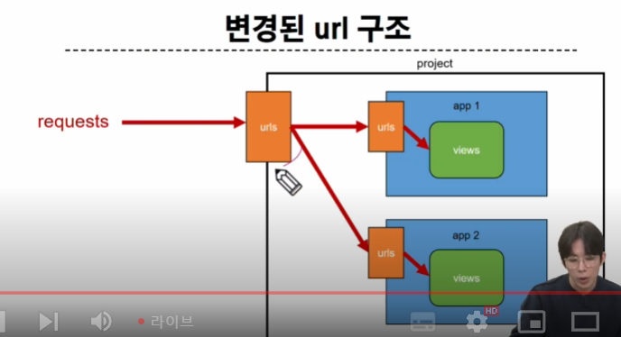

# Model
요청과 응답에서의 장고 URL의 ㅕㅇㄱ할은?
어플리케이션이 하나지만??
앱과 유알엘에 대해서 생각해보자면?!!?
프로젝트에 URL 존재
이 프로젝트에서만 유알엘 파일이 존재하면?각자의 앱에 URL.py를 추가로 생성하면..! 어떻지?!
프로젝트와 앱이 URL을 나눠서 관리하자 라는 것
2번재 앱을 만들었을 때 생기는 문제는??
url을 각각의 앱을 알아서 너네가 해랑
힘들당 라는 것

어디까지 일치하네? 하고 app으로 보내는것
url 연결 구조를 한 단계 더 만듬
프로젝트에는 각 연결하는 하나의 url만 있음 됨
본인 url을 각자 가지고 있어서 더 편함!

넘겨???
인클루드?
인클루드('문자열')
articles/index/ 이런식으로 주소가 이어짐

프로젝트 내부 앱들의 url을 참조할 수 있도록 매핑하는 함수
url의 일치하는 부분까지 잘라내고 남은 문자열 부분은 후속 처리를 위해 inclue된 url로 전달

include 적용했을 때 프로젝트 urls.가 변경된 것을 확인 가능

url 이름 지정

어렵당
catch주소 같은걸 이미 입력했는데 이걸 수정하고 싶으면 어쩌징...
너무 많은뎅...
이거 다바꾸는게 맞아??
그럼??
그럼 다 기억하지 말고 뭘 주지?
각각의 url에 이륾 주면 되지 않나??
이름을 주면 상세주소가 나중에 바뀌어도 굳이 그 이름 사용하는 다른곳에서 수정할 필요가 없음
쟝고에서 url 태그를 쓸거다
여기 url 이름을 쓰는 것

앱 이름을 태그로 쓰면 다른 거랑 충돌하지 않고 훨씬 명시적

```html
app_name = 'articles'
```
라는 이름을 준당
어렵당
살라달랑

Model
장고의 mtv 디자인 패턴에 모두다 써봤는디
모델을 써보지 못했어!
데이터 베이스를 
쓰루 캐치를 생각해 봤을 때

장고 모델
장고 테이블을 조작할 수 있고 테이블을 정의 만들어 낼 수 있다
테이블의 구조를 설계하는 청사진 블루프린트 설계도 짜는 곳

테이블이라고 했는디!
데이터 베이스 시간에 자세히 다루겠지만 이 데이터 베이스는 여러 테이블 들의 모임(ex) 엑셀 같은 행과 열로된 구조를 데이터 베이스는 테이블이라고 부름

실제로 데이터가 어케 저장되는거지?!
헉! 개어려웡!
이 설계도 대로 테이블을 만들거라....
모델스.py에서 테이블 짜는 설계도 만들기
우리 데이터가 올바르게 저장되게 하는 블루프린트를 만든다
class 공부해야함
ㅠ
oop
models에서 상속받음
models.
모듈을 임폴트한 것
models.py가 임폴트 된거고 거기서 작성된 class Model을 상속 받은 것

데이터 베이스에서는 열을 필드라고 함
클래스 변수는 필드의 이름이 된다
뒤쪽에 필드라는 클래스를 쓰는데 이게 데이터 타입임

모델 클래스== 테이블 설계도
테이블 구조를 어떻게 설계할지에 대한 코드만 작성하도록 하는 것
그냥 큰틀에서의 나 이런 테이블 만들거라는 구조만 짜면 된당
필드의 이름이달 ㅏ고 하는 것
모델 필드 클래스라고 하는 것
각각의 필드에 들어가야하는 데이터 들의 데이터 타입을 지정
이 데이터 타입에 해당하는 필드들은 아주많이 
공식문서 왔을때 가장먼저 봐야할걸?
목차를 가장 먼저 봐야함
필드 탕비을 보러 왔음
오토 필드 캐릭터 필드 데이트 필드 이메일 필드
파일 필드
이미지 필드
딱봐도 무슨 데이터를 받기 위한 필드일까?날짜 데이터를 이메일 형식으로 받기위한 필드
테이블에서 필요한 건 크게 보면 3가지 결국 3가지가 필요함
1. 필드 이름
2. 필드 데이터 타입
(선택 사항)
3. 필드의 제약 조건
우리 커뮤니티의 게시글의 제목은 최대 10자까지만 작성 가능하도록 설정
뭔가를 제한 시킴
필드의 제약 조건

악성 사용자가 우리 게시판에 게시글쓸때 몇천줄을 넣어야하는데 제안을 걸어야함
10자가 넘으면 제약 조건
캐릭터 필드에서 쓰는것
이메일 필드 파일 필드라든지 이런데서 쓸수있다?
모른다
읽어봐야한다
최대 길이가 10
요걸로 설계도를 만들면 타이틀필드에 들어가는 문자열은 10이 최대다
아항
마이그레이션스
모델 클래스의 변경사항(필드생성,수정 삭제 등)을 db에 최종 반영 하는 것
설계도 하나가 이렇게 들어감
마이그레이션 폴더에 이렇게 넣음
하나하나를 마이그레이션스 파일이라고 하고 이걸 기반으로 테이블을 만들라고 하는게 최종단계
id는 장고가 알아서 추가하는데 models.BigAutoField를 쓰는데 이게 머징
그대로 들어가 있음
총 세개 필드가 만들어 질 예정
설계도 해석해보면 
아래는 뭐 더이상 없음
절대로 중요한 사항
우리가 수정하는 부분 아님
수정 X

모델 필드
DB 테이블의 필드를 정의하고 해당 데이터 타입ㄱ ㅘㄴ리

캐릭터필드: 문자열 필드로 max_length가 필수인자이다
이게 없으면 마이그레이션 안된다
제약 조건이 반드시 있어야하는 문자열 필드
길이에 데이터 타입있는것

텍스트필드: 글자수가 많을때사용
대신 길이제한이없음
둘다 문자열 데이터 타입이다
대신 얘는 필수 인자가 없음

데이트타임필드
날짜와 시간 모두다 들어가는 필드
auto_now와 auto_now_add이 둘을 선택인자로 씀
데이터가 저장될때마다 값 바꿔줌
처음 생성될때만 값만 들어가고 새로 수정해도 갱신하지않음

## 어드민 사이트
우리는 지금 게시글을 못씀
게시글을 쓰기위해서는다른게 필요함
대신에?
저 테이블에 계정 생성 가능
숨겨ㅕ 있던 관리자 사이트ㅏㄱ 존재하는 건 알지

이걸 못쓰는 이유는? 관리자 계정을 만들수있는 방법을 몰라서

아우토매틱 어드민 인터페이스
장고는 그냥 관리자 인터페이스가 있다
데이터확인 삭제 시험이 테스트에 매주 편함

1. admin 계정 생성
계정 만들기


