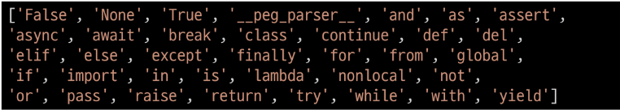
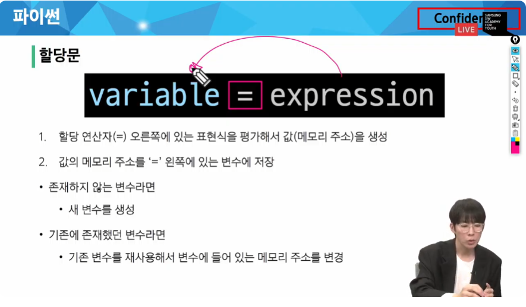
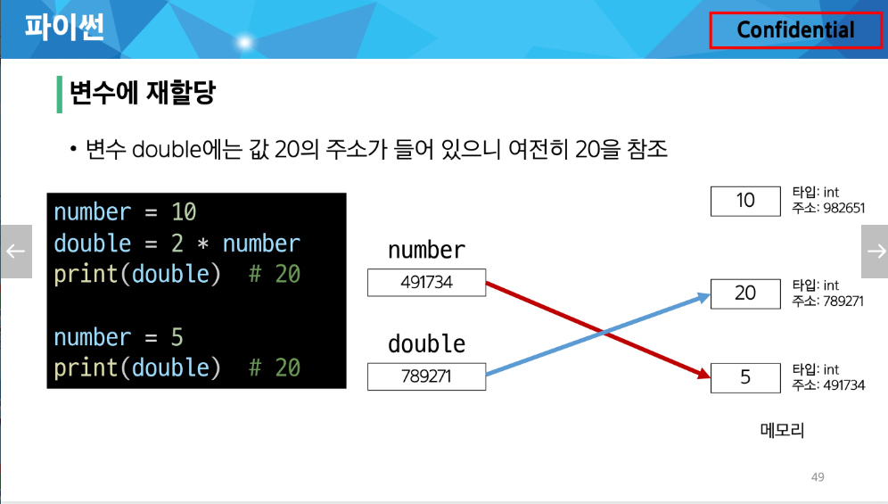
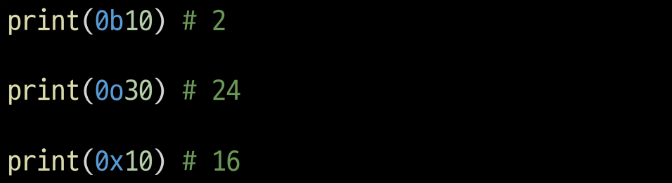
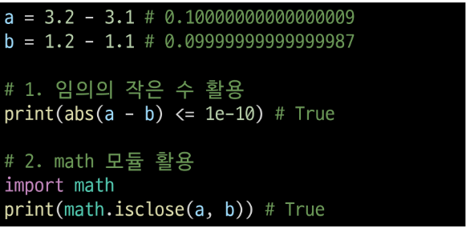
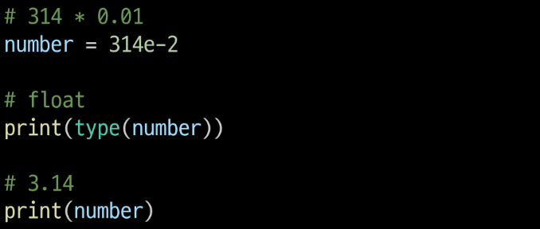
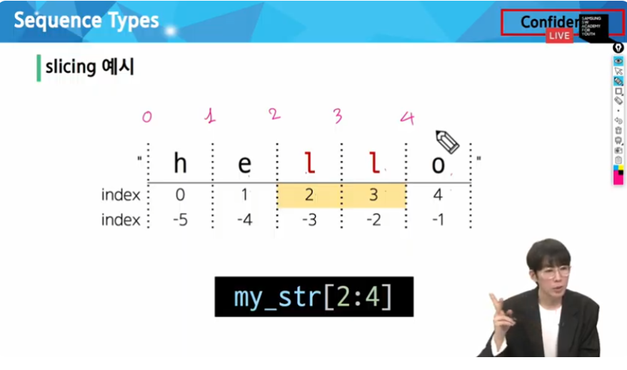
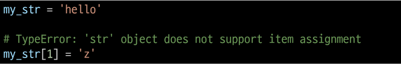

# 프로그래밍

* 프로그램 (Program) : 명령어들의 집합

*프로그래밍의 핵심 : 새 연산을 정의하고 조합해 유용한 작업을 수행하는 것 => '문제를 해결'하는 매우 강력한 방법

# 프로그래밍 언어

* 컴퓨터에게 작업을 지시하고 문제를 해결하는 도구

# 파이썬 (Python)

1. 파이썬을 사용하는 이유 : 간결하고 읽기 쉬운 문법
2. 다양한 응용 분야 : 데이터 분석, 인공지능, 웹 개발, 자동화 등
3. 파이썬 커뮤니티의 지원 : 세계적인 규모의 풍부한 온라인 포럼 및 커뮤니티 생태계

# 파이썬 프로그램이 실행되는 법

* 컴퓨터는 기계어로 소통하기 때문에 사람이 기계어를 직접 작성하기 어려워 `인터프리터`가 사용자의 명령어를 운영체제가 이해하는 언어로 바꿈
=> 운영체제가 달라도 파이썬이 맞춰서 이식해줌

# 파이썬 인터프리터를 사용하는 2가지 방법
1. shell 이라는 프로그램으로 한 번에 한 명령어 씩 입력해서 실행
    * git에 python -i 를 입력해서 사용
2. 확장자가 .py인 파일에 작성된 파이썬 프로그램을 실행=>이방법을 주로 사용할 것

# 표현식과 값

* 1+2 : 하나의 "표현식"
* 표현식 (Expression) : 값, 변수, 연산자 등을 조합하여 계산되고 결과를 내는 코드 구조
    * 표현식이 **평가**되어 값이 반환됨
    * 평가 (Evaluate) : 표현식이나 문장을 실행하여 그 결과를 계산하고 값을 결정하는 과정 => 표현식이나 문장을 순차적으로 평가하여 프로그램의 동작을 결정
        * 문장 (statement) : 실행 가능한 동작을 기술하는 코드 (조건문, 반복문, 함수 정의 등)
        * 표현식과 문장 => 문장은 보통 여러 개의 표현식을 포함
        

# 타입 (Type)

* 값이 어떤 종류의 데이터인지, 어떻게 해석되고 처리되어야 하는지를 정의
    * 값 (피연산자) 와 연산자 2가지 요소로 이루어짐 ex)1(값, 피연산자) + (연산자) 2

    * **값**과 **값에 적용할 수 있는 연산**

* 피연산자 데이터 타입 (크게 6개)
    * Numeric Type : int (정수), float (실수), complex (복소수)
    * Sequence Types : list, tuple, range
    * Text Sequence Type : str (문자열)
    * Set Types : set
    * Mapping Types : dict
    * 기타 : None, Boolean, Functions

* 산술 연산자

기호|  연산자  |
---|---
-|음수 부호
+|덧셈
-|뺄셈
*|곱셈
/|나눗셈
//|정수 나눗셈 (몫)
%|나머지
**|지수 (거듭제곱)

* 연산자 우선 순위

|우선순위|연산자|연산|
|-------|---|---|
|높음|**|지수|
|  |-|음수 부호|
|  |*, /, //, %| 곱셈, 나눗셈, 정수 나눗셈, 나머지|
|낮음|+, -|덧셈, 뺄셈|

# 변수 (Variable)
* 값을 참조하는 이름
* 어떠한 값을 바라보고 있음 **참조**

* 변수명 규칙
    1. 영문 알파벳, 언더스코어(_), 숫자로 구성
    2. 숫자로 시작할 수 없음
    3. 대소문자를 구분
    4. 변수로 사용할 수 없는 일부의 예약어가 있음
    

* 변수, 값 그리고 메모리
    * 거리에 집 주소가 있듯이 메모리의 모든 위치에는 그 위치를 고유하게 식별하는 메모리 주소가 존재
    
    * 변수에는 그 변수가 아닌 그 변수가 참조하는 메모리 주소를 가짐

    * 객체 (Object) : 타입과 주소 값을 가지는 것
        * 타입을 갖는 메모리 주소 내 값
        * 값이 들어있는 상자

* 할당문
이름 = 표현식 (여기서 = 이 할당 연산자)
    1. 할당 연산자(=) 오른쪽에 있는 표현식을 평가해서 값(메모리 주소)을 생성
    2. 값의 메모리 주소를 '=' 왼쪽에 있는 변수에 저장
        * 존재하지 않는 변수라면
            * 새 변수를 생성
        * 기존에 존재했던 변수라면
            * 기존 변수를 재사용해서 변수에 들어 있는 메모리 주소를 변경
            * [실습](./python/basic-sample.py)
            * 관점을 오른쪽에 있는 주소값이 왼쪽에 저장이 된다라고 생각 
            
변수할당과정

변수에 재할당

# Style Guide (읽기 좋은 코드)

* 코드의 **일관성**과 **가독성**을 향상시키기 위한 규칙과 권장 사항들의 모음
* 프로그래밍 언어의 맞춤법!

* 파이썬 Style Guide
    1. 변수명은 무엇을 위한 변수인지 직관적인 이름을 가져야 함 
        * ex) a = 5 같은거 말고 저 값이 어떠한 것에 대한 변수인지 명확하게 알 수 있어야 한다.
    2. 들여쓰기로 구성되는 문법으로 공백 (spaces) 4칸을 사용하여 코드 블록을 들여쓰기
        * Tab 을 누르면 4칸을 공백으로 해주도록 설정 되어있음 안되어 있으면 다시 설치 페이지 확인
        [설치 페이지]
    3. 한 줄의 길이는 79자로 제한하며, 길어질 경우 줄 바꿈을 사용
    4. 문자와 밑줄(_)을 사용하여 함수, 변수, 속성의 이름을 작성
        * 가독성을 위해 밑줄 사용이 추천됨
    * 함수 정의나 클래스 정의 등의 블록 사이에는 빈 줄을 추가
        * 초반에 버릇을 잘 들여야 함! 교재/실습은 무조건 잘 지켜야 하고 자신 없으면 강의나 자료를 따라할 것!
        * [규칙사이트_pep-0008](https://peps.python.org/pep-0008/)

## Python Tutor => 참고사항
* 파이썬 프로그램이 어떻게 실행되는지 도와주는 시각화 도우미

[파이썬 튜터](https://pythontutor.com/)

* 주석 달기: ctrl+/

* 주석 (Comment)
    * 프로그램 코드 내에 작성되는 설명이나 메모
    * 인터프리터에 의해 실행되지 않음

* 주석의 목적
    * 코드의 특정 부분을 설명하거나 임시로 코드를 비활성화할 때
    * 코드를 이해하거나 문서화하기 위해
    * 다른 개발자나 자신에게 코드의 의도나 동작을 설명하는 데 도움

# Data Types

* 값의 종류와 그 값에 적용 가능한 연산과 동작을 결정하는 속성
    ex) 3 - 1 = 2
        'Hello' - 1 = ??

* 데이터 타입 분류
    1. Numeric Types
        * int (정수), float (실수), complex (복소수)
    2. Text Sequence Type
        * str (문자열)
    3. Sequence Types
        * list, tuple, range
    4. Non-sequence Types
        * set, dict
    5. 기타
        * Boolean, None, Functions

* 데이터 타입이 필요한 이유
    1. 값들을 구분하고, 어떻게 다뤄야 하는지를 알 수 있음
    2. 요리 재료마다 특정한 도구가 필요하듯이 각 데이터 타입 값들도 각자에게 적합한 도구를 가짐
    3. 타입을 명시적으로 지정하면 코드를 읽는 사람이 변수의 의도를 더 쉽게 이해할 수 있고, 잘못된 데이터 타입으로 인한 오류를 미리 예방

* 오늘의 데이터 타입
    1. Numeric Types, Text Sequence Type

# Numeric Types
1. int (정수 자료형) : 
    * 진수 표현
        1. 2진수 (binary): 0b
        2. 8진수 (octal) : 0o
        3. 16진수 (hexadecimal) : 0x
    

2. float (실수 자료형) : 실수를 표현하는 자료형, 소수점이 있는 자료형
* 프로그래밍 언어에서 float는 실수에 대한 **근삿값**
    * 유한 정밀도 : 컴퓨터 메모리 용량이 한전돼 있고 한 숫자에 대해 저장하는 용량이 제한 됨
    * 0.6666666666666666과 1.6666666666666667은 제한된 양의 메모리에 저장할 수 있는 2/3과 5/3에 가장 가까운 값

* 실수 연산 시 주의사항
    1. 컴퓨터는 2진수를 사용, 사람은 10진법을 사용
    2. 이때 10진수 0.1은 2진수로 표현하면 0.0001100110011001100110... 같이 무한대로 반복
    3. 무한대 숫자를 그대로 저장할 수 없어서 사람이 사용하는 10진법의 근삿값만 표시
    4. 0.1의 경우 3602879701896397 / 2 ** 55 이며 0.1에 가갑지만 정확히 동일하지는 않음
    5. 이런 과정에서 예상치 못한 결과가 나타남
    6. 이런 증상을 **Floating point rounding error**라고 함
* 실수 연산 시 해결책
    * 두 수의 차이가 매우 작은 수보다 작은지를 확인하거나 math 모듈 활용
        
* 지수 표현 방식
    * e 또는 E를 사용한 지수 표현
        

3. Sequence Types (정확히는 Text Sequence Type)
* 여러 개의 값들을 순서대로 나열하여 저장하는 자료형 (str, list, tupe, range)가 있는데 오늘은 문자열인 str만 다룸
    * Sequence Types 특징
        1. 순서 (Sequence) : 값을이 순서대로 저장 (정렬 X 정렬은 1,2,3,4 순서대로 저장은 그냥 2,1,4,3 이렇게 그냥 순서를 가지고 저장된 것)
        2. 인덱싱 (indexing) : 각 값에 고유한 인덱스 (번호)를 가지고 있으며, 인덱스를 사용하여 특정 위치의 값을 선택하거나 수정할 수 있음
        3. 슬라이싱 (Slicing) : 인덱스 범위를 조절해 부분적인 값을 추출할 수 있음
        4. 길이 (Length) : len() 함수를 사용하여 저장된 값의 개수(길이)를 구할 수 있음
        ex) 'hello'의 길이는? 5
        5. 반복 (Iteration) : (길이가 있기 때문에) 반복문을 사용하여 저장된 값들을 반복적으로 처리할 수 있음

# str (문자열)
* 문자들의 **순서가 있는 변경 불가능한** 시퀀스 자료형

* 문자열 표현
    * 문자열은 단일 문자나 여러 문자의 조합으로 이루어짐
    * 작은따옴표(') 또는 큰따옴표(")로 감싸서 표현
        * 한 번 작은따옴표를 썼으면 작은따옴표로 쓰고 큰따옴표로 쓰면 큰따옴표로 쓰는데 교안과 수업은 작은 따옴표로 통일해서 진행된다.

* 중첩 따옴표
    * 따옴표 안에 따옴표를 표현할 경우
        * 작은따옴표가 들어 있는 경우는 큰따옴표로 문자열 생성
        * 큰따옴표가 들어 있는 경우는 작은따옴표로 문자열 생성

        근데 섞어 쓰고 싶다면?

* Escape sequence
    * 역슬래시 (backslash) 뒤에 특정 문자가 와서 특수한 기능을 하는 문자 조합
    * 파이썬의 일반적인 문법 규칙을 잠시 탈출한다는 의미

|예약문자|내용 (의미)|
|---|---|
|\n|줄 바꿈|
|\t|탭|
| \ \ |백슬래시|
|\'|작은 따옴표|
|\"|큰 따옴표|

# String Interpolation
* 문자열 내에 변수나 표현식을 삽입하는 방법
    * f-string
        * 문자열에 f 또는 F 접두어를 붙이고 표현식을 {expression}로 작성하여 문자열에 파이썬 표현식의 값을 삽일할 수 있음

        [파이썬 실습](./python/string-sample.py)

* 문자열의 시퀀스 특징
    * 인덱스 (index) : 시퀀스 내의 값들에 대한 고유한 번호로, 각 값의 위치를 식별하는 데 사용되는 숫자
    * 슬라이싱 (slicing) : 시퀀스 일부분을 선택하여 추출하는 작업
        * 시작 인덱스와 끝 인덱스를 지정하여 해당 범위의 값을 포함하는 새로운 시퀀스를 생성

    * 인덱스 안 틀리기
        * 슬라이싱 관점을 반 칸 앞으로

        * my_str[0:5:2] : 0부터 5까지 하는데 2칸씩 잘라서 값을 내놔라 라는 의미

        * 근데 지금까지는 앞에서 뒤로만 감 거꾸로는?
my_str[::-1] : 처음과 끝까지 방향을 반대로 가라

    * 문자열은 변경이 불가
    인덱스로 접근은 가능하지만, n 추출하고~ 슬라이싱으로 자르고~ 접근은 가능한데 얘를 바꿀수는 없음
    

    *문자열은 중가아이템에 대한 할당을 지원하지 않음, 일부분 바꾸기 불가능
    * 수도 사실상 불가능 불변은 메모리를 유지하면서 데이터 값을 바꿀수없다는 특성을 가지고 있음

* 과제 주소
https://lab.ssafy.com/s11/python/python